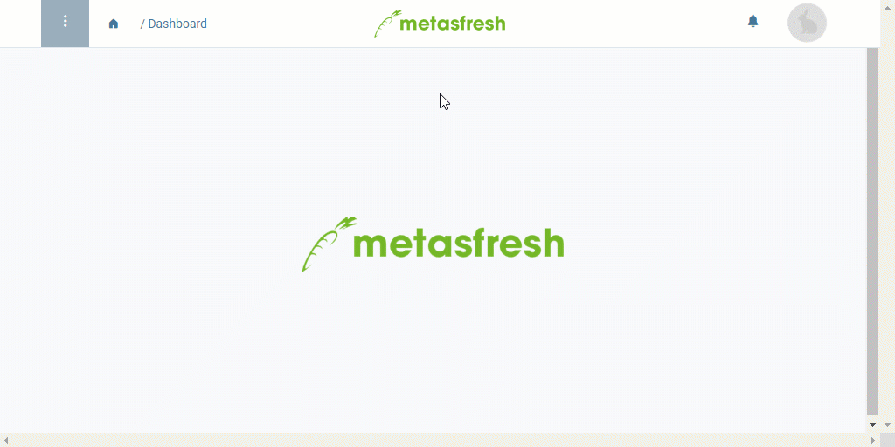

## Überblick
In metasfresh kannst Du ganz einfach alle Produktspezifikationen auf einmal exportieren.

Weitere Informationen über den Export einzelner Dateneinträge gibt es [hier](Datenexport_aus_metasfresh).

## Schritte
1. [Gehe ins Menü](Menu) und öffne das Fenster "Produkte" in der [Listenansicht](Ansichten#listenansicht).
1. [Starte die Aktion](AktionStarten#aktionsmenue) "Abfrage für Spezifikation". Es öffnet sich das "Speichern unter"-Dialogfenster.
1. Übernimm den vorgeschlagenen Dateinamen oder vergib einen neuen und speichere die Datei in einem Verzeichnis Deiner Wahl.
1. Bewege Dich in dieses Verzeichnis und öffne die Datei in einem Tabellenkalkulationsprogramm, z.B. *Microsoft Excel*.

## Beispiel
<kbd></kbd>
