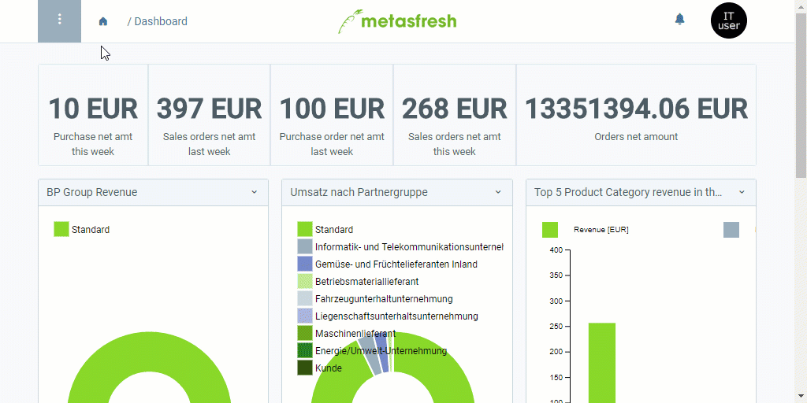

## Voraussetzungen
1. Stelle sicher, dass alle Voraussetzungen für den [Datenimport in metasfresh](Datenimport_nach_metasfresh) erfüllt sind. [Hier findest Du ein Formatbeispiel für den Import von IFA-Produktdaten](Importformat_Beispiel_Produkt_Pharma).
 >**Hinweis:** Für den IFA-Produktdatenimport benötigst Du ein Importformat, in dem die **DB-Tabelle** *Import Pharma Product* eingestellt ist.

1. Stelle sicher, dass der jeweilige Anbieter eines IFA-Produktes unter "[Geschäftspartner Pharma](Menu)" vorhanden ist. Ist dies nicht der Fall, erstelle zuerst entweder [einen neuen Eintrag für den jeweiligen Geschäftspartner](Neuer_Geschaeftspartner) oder [importiere die IFA-Herstellerdaten](GPartnerdaten_importieren_Pharma).

## Schritte
1. [Gehe ins Menü](Menu) und öffne das Fenster "Daten Import".
1. Öffne einen geeigneten Datenimporteintrag oder [lege einen neuen an](Datenimporteintrag_anlegen).

### Importdatei hochladen und importieren
1. [Lade Deine Importdatei mit den IFA-Produktdaten hoch](Dateihandling).
1. [Starte die Aktion](AktionStarten) "Import attachment". Es öffnet sich ein Overlay-Fenster.
1. Wähle im Feld **Anhang** die hochgeladene [Importdatei](Importdatei_nuetzliche_Hinweise) aus.
1. Klicke auf "Start", um die IFA-Produktdaten zu importieren und das Overlay-Fenster zu schließen.

### IFA-Produktdaten überprüfen
1. [Gehe ins Menü](Menu) und öffne das Fenster "Import Pharma Product". Hier findest Du alle importierten IFA-Produkteinträge.
1. Öffne den Eintrag des IFA-Produktes, dessen Daten Du überprüfen und ggf. korrigieren möchtest.
 - Konnten beim Import alle Daten fehlerfrei übertragen werden, dann ist der IFA-Produkteintrag hier schreibgeschützt und Du findest die importierten Daten unter dem Menüpunkt "[Produkt Pharma](Menu)" wieder, wo Du nun Änderungen vornehmen kannst.
 - Sollten einige Daten beim Import nicht oder fehlerhaft übertragen worden sein, kannst Du diese Fehler im jeweiligen IFA-Produkteintrag unter "[Import Pharma Product](Menu)" korrigieren. Hast Du alle Fehler behoben, kannst Du die IFA-Produktdaten nun manuell importieren. Gehe hierzu wie folgt vor:

#### IFA-Produktdaten manuell importieren
1. [Starte die Aktion](AktionStarten) "Import Pharma Product". Es öffnet sich ein Overlay-Fenster.
1. Klicke auf "Start", um die IFA-Produktdaten zu importieren und das Overlay-Fenster zu schließen.
1. Die importierten IFA-Produktdaten findest Du nun unter dem Menüpunkt "[Produkt Pharma](Menu)" wieder.

## Beispiel

