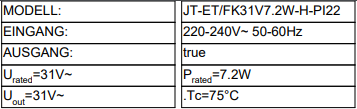
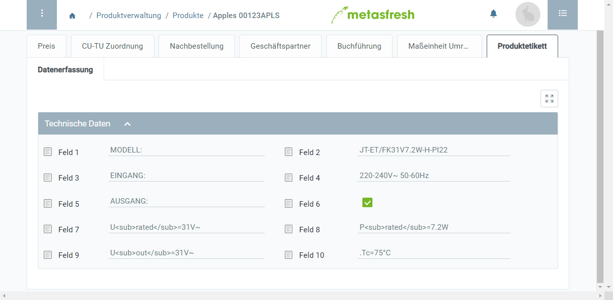

## Übersicht
In metasfresh kannst Du in verschiedenen Eingabefenstern benutzerdefinierte Registerkarten anlegen zur Erfassung eigener spezifischer Daten. Diese Daten lassen sich mithilfe von Unterregistern, Sektionen, Zeilen sowie Eingabefeldern organisieren und so auch in der Form von Produktetiketten oder Typenschildern ausdrucken.

## Voraussetzungen
- [Erstelle eine benutzerdefinierte Registerkarte im Fenster "Produkt" mit Unterregistern](Benutzerdefinierte_Registerkarte_anlegen), [Sektionen, Zeilen](Unterregister_Sektion_hinzufuegen) und [Feldern](Sektionszeilen_Felder_hinzufuegen) entsprechend Deinen Anforderungen.

## Schritte

### Daten für das Produktetikett erfassen
1. Öffne den Eintrag eines bestehenden [Produktes](Menu) bzw. [lege ein neues an](NeuesProdukt).
1. Gehe zur benutzerdefinierten Registerkarte unten auf der Seite und erfasse dort die Etikettdaten.

| **Hinweis:** |
| :--- |
| Du kannst Zeichen und Wörter mithilfe von HTML-Tags hoch- oder tiefstellen: |
| •&nbsp;**Hochstellung:** min``-1`` &rarr; min-1   •&nbsp;**Tiefstellung:** H``2``O &rarr; H2O |

### Produktetikett drucken
1. [Starte die Aktion](AktionStarten) "Products Data Entry (Jasper)".
1. Das Produktetikett wird in einem neuen Browser-Tab als PDF-Vorschau geöffnet.

## Beispiel

### Produktetikett

### Eingabefenster

