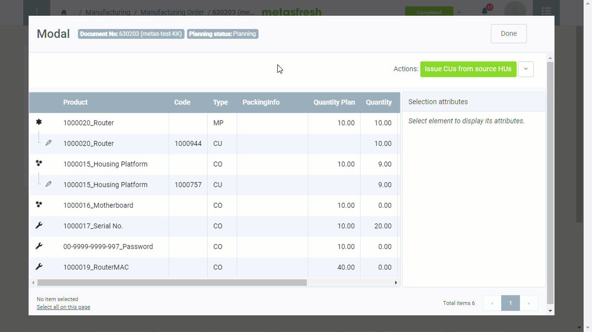

<!--
## Überblick
metasfresh bietet zwei Möglichkeiten, den Materialverbrauch bei der Produktion zu protokollieren:
1. Ein Produkt herstellen, ohne Material zu verbrauchen.
1. Ein Produkt herstellen und Materialverbrauch protokollieren.
-->

## Voraussetzungen
1. [Erfasse einen Produktionsauftrag](NeuerProduktionsauftrag) für das Fertigungsprodukt und [stelle ihn fertig](BelegverarbeitungFertigstellen).
1. Vergewissere Dich vor der Produktion, dass die benötigten [Produktionskomponenten](Stuecklistenbestandteile_erfassen) **in ausreichender Menge** für den Verbrauch auf Lager sind. Um den Bestand aufzufüllen, kannst Du entweder: 
  **a)** einen [Wareneingang erstellen](Zu_Bestellung_Wareneingang_erstellen) oder 
  **b)** per [Inventur neue Handling Units erstellen](Inventur_HUs_erstellen).

## Schritte
1. [Gehe ins Menü](Menu) und öffne das Fenster "Produktionsaufträge".
1. Öffne den Eintrag eines [fertiggestellten Produktionsauftrags](NeuerProduktionsauftrag).
1. [Starte die Aktion](AktionStarten#aktionsmenue) "Produzieren". Es öffnet sich ein Overlay-Fenster, das Produktionsfenster.
 >**Hinweis:** Hast Du den Produktionsauftrag in der [Listenansicht](Ansichten#listenansicht) selektiert, kannst Du ebenfalls über den [Quick-Actions](AktionStarten#quick-actions)-Button oben rechts die Aktion  starten.

### <a name="produktionsverbrauch">Verbrauchte Produktionskomponenten erfassen</a>

<!-- OBSOLETE
b) Produkt herstellen und Materialverbrauch protokollieren
Hierbei werden die für die Produktion benötigten Stücklistenbestandteile vom Bestand abgebucht. Die Zubuchung der produzierten Menge erfolgt wie oben beschrieben.
-->

1. [Selektiere](AuswahlBelege) im Produktionsfenster die Produktionskomponente <kbd></kbd> (**Art** *CO*, "Component"), welche zugeteilt und vom Bestand abgebucht werden soll, z.B. "Karotten ungewaschen".

   <kbd></kbd>

1. [Starte die Quick-Action](AktionStarten#quick-actions) "HU-Auswahlfenster öffnen".

   <kbd></kbd>

1. Es öffnet sich eine Übersicht auf der rechten Seite mit den passenden Handling Units (HU) vom Lager.

   <kbd></kbd>

1. [Selektiere](AuswahlBelege) die HU, die bei der Produktion verbraucht wurde.

#### a) Komplette HUs verbrauchen
1. [Starte die Quick-Action](AktionStarten#quick-actions) "Komplette HUs hinzufügen".
1. Nach erfolgreicher Zuordnung siehst Du die hinzugefügte HU unterhalb der Produktionskomponente.

   <kbd></kbd>

   >**Hinweis:** Möchtest Du die Abbuchung rückgängig machen, wähle einfach die hinzugefügte HU aus und starte die Quick-Action "HU entfernen".

#### b) Ausgewählte HUs mit Seriennummern verbrauchen
1. [Starte die Quick-Action](AktionStarten#quick-actions) "Add CUs with Serial Numbers". Es öffnet sich ein Overlay-Fenster.
1. Trage in das Feld **SerialNo** die Seriennummer der HU ein, die bei der Produktion verbraucht wurde. Mehrere Seriennummern können mittels Zeilenumbrüchen (`⇧ Shift` + `↵ Enter`) erfasst werden.
1. Klicke auf "Start", um das Overlay-Fenster zu schließen und die seriellen HUs zu generieren.
1. [Selektiere](AuswahlBelege) die HU, die bei der Produktion verbraucht wurde
1. [Starte die Quick-Action](AktionStarten#quick-actions) "Komplette HUs hinzufügen".

#### c) HUs automatisch abbuchen (z.B. bei Massenware)
1. [Starte die Quick-Action](AktionStarten#quick-actions) "Als Quell-HUs wählen".
1. Die HU wird nun am Ende der Liste als schreibgeschützte Zeile hinzugefügt.
1. [Selektiere](AuswahlBelege) die Zeile der Produktionskomponente, für die Du eine Quell-HU hinzugefügt hast.
1. [Starte die Quick-Action](AktionStarten#quick-actions) "CUs aus Quell-HUs hinzufügen". Es öffnet sich ein Overlay-Fenster.
1. Gib eine **Menge CU/TU** ein.
1. Klicke auf "Start", um das Overlay-Fenster zu schließen und die angegebene Menge der Produktionskomponente zuzuteilen.
1. ***Optional:*** [Selektiere](AuswahlBelege) die Zeile der zugeteilten Produktionskomponente und [starte die Quick-Action](AktionStarten#quick-actions) "HU entfernen", um die Zuteilung rückgängig zu machen.
1. ***Optional:*** [Selektiere](AuswahlBelege) die Zeile der Quell-HU und [starte die Quick-Action](AktionStarten#quick-actions) "Soll keine Quell-HU mehr sein", um die HU wieder aus der Liste zu entfernen.

### Empfang des hergestellten Produktes

<!-- OBSOLETE
### a) Produkt herstellen, ohne Material zu verbrauchen
Dies ist die einfachste Möglichkeit in metasfresh zu produzieren. Hierbei wird die produzierte Menge einfach dem Bestand zugebucht, ohne dass die benötigten Stücklistenbestandteile abgebucht werden.

## Beispiel 1
<kbd></kbd>
-->

1. [Selektiere](AuswahlBelege) im Produktionsfenster das hergetellte Produkt <kbd></kbd> (**Art** *MP*, "Manufacturing Product"), welches empfangen werden soll, z.B. "Karotten gestückelt".

    <kbd></kbd>

1. [Starte die Quick-Action](AktionStarten#quick-actions) "Empfangen".

    <kbd></kbd>

    >**Hinweis:** Wurde dem Produkt eine Packvorschrift zugewiesen, erscheint diese auf dem Quick-Actions-Button anstelle von "Empfangen".
    <kbd></kbd>

1. Es öffnet sich ein weiteres Overlay-Fenster.

    <kbd></kbd>

1. ***Optional:*** Wähle eine **Packvorschrift TU** aus.
 >**Hinweis:** [Nähere Informationen über HU-Komponenten wie LU, TU und CU](Handling_Unit_System).

1. ***Optional:*** Wähle eine **Packvorschrift LU** aus.
1. Trage in das Feld **Menge CU** die empfangene Menge des Produktes ein.
1. Trage in das Feld **Menge TU** die Anzahl der Transporteinheiten ein.
 >**Hinweis 1:** Das Feld **Menge TU** erscheint nur, wenn auch eine **Packvorschrift TU** ausgewählt wurde.  
 >**Hinweis 2:** Die Menge TU muss ***mindestens 1*** betragen.

1. Trage in das Feld **Menge LU** die Anzahl der Ladehilfsmittel ein.
 >**Hinweis 1:** Das Feld **Menge LU** erscheint nur, wenn auch eine **Packvorschrift LU** ausgewählt wurde.  
 >**Hinweis 2:** Das Feld **Packvorschrift LU** erscheint nur, wenn auch eine **Packvorschrift TU** ausgewählt wurde.  
 >**Hinweis 3:** Die Menge LU muss ***mindestens 1*** betragen.

1. Klicke auf "Start", um die empfangenen HUs zu erfassen und das Overlay-Fenster zu schließen.
1. Nach erfolgreicher Zuordnung werden die empfangenen HUs unterhalb des hergestellten Produktes aufgelistet:

    <kbd></kbd>

     >**Hinweis:** Möchtest Du die Zuordnung rückgängig machen, [selektiere](AuswahlBelege) einfach die hinzugefügte HU, gehe zum Quick-Actions-Button und klicke auf "HU entfernen".

#### HUs mit Seriennummern manuell erfassen (optional)
1. [Selektiere](AuswahlBelege) im Produktionsfenster die HU, dessen Seriennummer Du erfassen möchtest.
1. Gib auf der rechten Seite unter "[Merkmale](Merkmal_Produkt_neu_anlegen)" in das Feld **SerialNo** die Seriennummer der HU ein.
1. [metasfresh speichert automatisch](Speicheranzeige).

#### <a name="komponentengenerator-produktion">HU-Merkmale automatisch erzeugen mit dem Komponentengenerator (optional)</a>
Sofern in der [Stückliste](Stueckliste_erstellen) des Fertigungsproduktes [Dienstleistungsprodukte](Dienstleistungsprodukt_anlegen) enthalten sind, die im Zusammenhang mit dem [Komponentengenerator](Komponentengenerator_Einrichtung) zur Erzeugung individueller [Merkmale](Merkmal_Produkt_neu_anlegen) verwendet werden können (wie Seriennummern, werkseitige Passwörter usw.), werden diese als zusätzliche Service-Komponenten <kbd></kbd> (**Art** *CO*) im Produktionsfenster aufgelistet. Um die jeweiligen Merkmalswerte für das hergestellte Produkt zu erzeugen, gehe wie folgt vor:

1. [Selektiere](AuswahlBelege) im Produktionsfenster die Service-Komponente, zum Beispiel *Seriennummer*.
1. [Starte die Quick-Action](AktionStarten#quick-actions) "Issue Service" (*Dienst ausführen*). Es öffnet sich ein Overlay-Fenster.
1. ***Optional:*** Setze ein Häkchen bei **Override Existing Values** (*Vorhandene Werte überschreiben*).
1. Klicke auf "Start", um die individuellen Werte des Dienstleistungsproduktes zu erzeugen und das Overlay-Fenster zu schließen.
1. Das Fertigungsprodukt wird nun automatisch in die einzelnen CUs mit ihren individuellen Merkmalswerten aufgeteilt.

    <kbd></kbd>

### Produktionsauftrag verarbeiten und Bestandsbuchungen auslösen
1. [Starte die Quick-Action](AktionStarten#quick-actions) "Verarbeiten", um die Materialbuchung vorzunehmen. Dadurch werden die Zeilen schreibgeschützt:

    <kbd></kbd>

    <!--
    <kbd></kbd>
    -->

1. Klicke auf "Bestätigen", um das Produktionsfenster zu schließen.
1. Der Produktionsauftrag erhält nun den **Planstatus** *Fertig*.

| **Hinweis:** |
| :--- |
| Die neu erstellte HU wird nun unter der Registerkarte "Handling Unit Assignment" unten auf der Seite des jeweiligen Produktionsauftrages aufgeführt und in der Spalte **Handling Unit** der HU-Zeile mit dem [Handling Unit Editor](Menu) verknüpft. [Zoome](Zoomen_in_Tabellenfeld) in das Feld, um den Eintrag zu öffnen. Im Eintrag der HU wiederum findest Du den jeweiligen Produktionsauftrag unter der Registerkarte "Handling Unit Referenzen" unten auf der Seite verknüpft. |

## Beispiel
<kbd></kbd>
