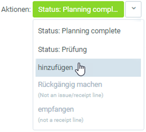

## Übersicht
metasfresh bietet zwei Möglichkeiten, den Materialverbrauch bei der Produktion zu protokollieren:
1. Produkt herstellen, ohne Material zu verbrauchen.
1. Produkt herstellen und Materialverbrauch protokollieren.

## Vorbereitung
Stelle sicher, dass Du diejenigen Produkte, die Du bei der Produktion verbrauchst, vorher auch auf Lager hast.
[Hier](Zu_Bestellung_Wareneingang_erstellen) kannst Du nachlesen, wie Du einen Wareneingang erstellst.

## Schritte
1. Öffne einen [fertigen Produktionsauftrag](NeuerProduktionsauftrag).
1. [Starte die Aktion](AktionStarten) "Produzieren". Es öffnet sich das Produktionsfenster.
 > Hinweis: Hast Du den Produktionsauftrag in der Listenansicht ausgewählt, kannst du ebenfalls über den [Quick-Actions](AktionStarten)-Button oben rechts die Aktion  starten.

### 1. Produkt herstellen, ohne Material zu verbrauchen
Dies ist die einfachste Möglichkeit in metasfresh zu produzieren. Hierbei wird die produzierte Menge einfach zugebucht, ohne die benötigten Produkte aus der Stückliste abzubuchen.

1. Klicke im Produktionsfenster das Produkt an, welches Du herstellen möchtest, z.B. "Karotten gestückelt".
 

1. Wähle über den Quick-Actions-Button "empfangen" aus. 
  
 > Hinweis: Wurde dem Produkt eine Gebindekonfiguration zugewiesen, erscheint diese auf dem Quick-Actions-Button anstelle von "empfangen".
  

1. Es öffnet sich ein neues Fenster.
 

1. Im Feld **Menge CU** trägst Du die fertiggestellte Menge des Produkts ein.

1. Im Feld **Menge TU** trägst Du die Menge der Verpackungseinheiten ein.
 > Hinweis 1: Das Feld **Menge TU** erscheint nur, wenn auch eine **Packvorschrift TU** vorhanden ist.  
 > Hinweis 2: Die Menge TU muss **mindestens 1** betragen.

1. Im Feld **Menge LU** trägst Du die Menge der Ladehilfsmittel ein.
 > Hinweis 1: Das Feld **Menge LU** erscheint nur, wenn auch eine **Packvorschrift LU** vorhanden ist.  
 > Hinweis 2: Das Feld **Packvorschrift LU** erscheint nur, wenn auch eine **Packvorschrift TU** vorhanden ist.

1. Klicke auf "Start", um die Zuordnung zu speichern.

1. Nach erfolgreicher Zuordnung siehst Du die zugeordneten Produkte unterhalb des herzustellenden Produktes:
 

1. Wähle über den Quick-Actions-Button "Status: Planning complete" aus, um die Materialbuchungen vorzunehmen. Dadurch werden die Zeilen schreibgeschützt:
 

1. Klicke auf "Bestätigen", um das Fenster zu schließen.

## Beispiel 1

### 2. Produkt herstellen und Materialverbrauch protokollieren
Hierbei werden die für die Produktion benötigten Produkte aus der Stückliste abgebucht. Die Zubuchung der produzierten Menge erfolgt wie oben beschrieben.

1. Klicke im Produktionsfenster die Komponente (**CO**) an, welche Du aus der Stückliste abbuchen möchtest, z.B. "Karotten ungewaschen".
 

1. Wähle über den Quick-Actions-Button "hinzufügen" aus. 
 

1. Es öffnet sich eine Übersicht mit den passenden Handhabungseinheiten (Handling Unit - HU) vom Lager.
 

1. Wähle die HU aus, welche für die Produktion verbraucht werden soll.

1. Wähle über den Quick-Actions-Button nochmals "hinzufügen" aus.

1. Nach erfolgreicher Abbuchung siehst Du die abgebuchten Produkte unterhalb der Komponente.

 > Hinweis: Möchtest Du die Abbuchung rückgängig machen, wähle einfach die hinzugefügte HU aus, gehe zum Quick-Actions-Button und klicke auf .

1. Klicke auf "Bestätigen", um das Fenster zu schließen.

## Beispiel 2

