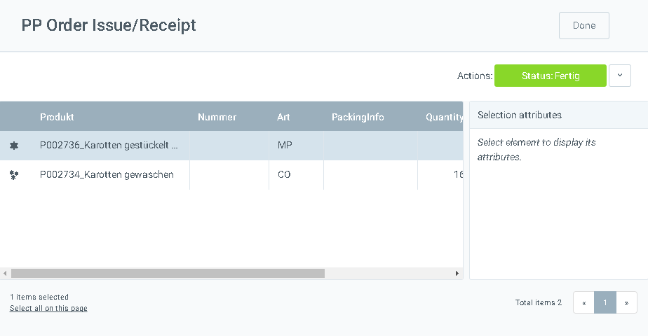
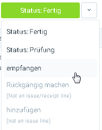
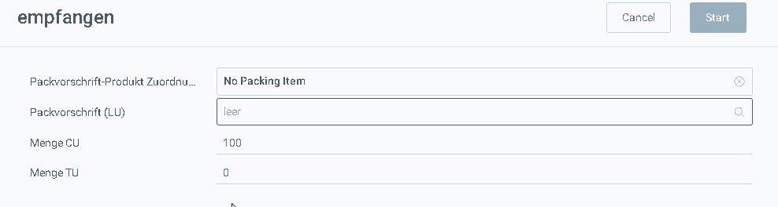

## Vorbereitung
Stell sicher, dass du diejenigen Produkte, die du bei der Produktion verbrauchst vorher auch an Lager hast.
[Lies hier](Zu_Bestellung_Wareneingang_erstellen) wie Du einen Wareneingang machst.

## Schritte

1. [Lege einen Produktionsauftrag an](NeuerProduktionsauftrag)
1. Wähle den Produktionsauftrag in der [Listenansicht](Ansichten) aus
1. [Wähle die Aktion](AktionStarten) "Produzieren"
1. Es öffnet sich das Produktionsfenster

### Produkt herstellen ohne Material zu verbrauchen
Dies ist die einfachste Möglichkeit in metasfresh zu produzieren. Hierbei wird die produzierte Menge einfach zugebucht ohne die benötigten Produkte aus der Stückliste abzubuchen.

1. Du siehst das Produktionsfenster vor dir
 

1. Klicke das Produkt an, das Du herstellen möchtest
> Hinweis: Im Beispiel "Karotten gestückelt"

1. wähle die Aktion "empfangen" aus

 

1. es öffnet sich ein neues Fenster

1. in **CU** trägst Du die fertiggestellte Menge des Produkts ein
1. in **TU** die Menge der Verpackungseinheiten, aber mindestens 1
1. in **LU** die Menge der Ladehilfsmittel
> Hinweis: Wenn Du keine LU brauchst, klick auf das X bei der Gebindekonfiguration. Dann verschwindet das Feld:

1. Klicke auf Start um die Zuordnung zu speichern
1. Nach erfolgreicher Zuordnung siehst du die zugeordneten Produkte unterhalb des herzustellenden Produktes:

 

1. Klicke auf die Aktion "Status: Fertig" um die Materialbuchungen vorzunehmen. Dadurch werden die Zeilen schreibgeschützt:
 

1. Klicke auf Done
