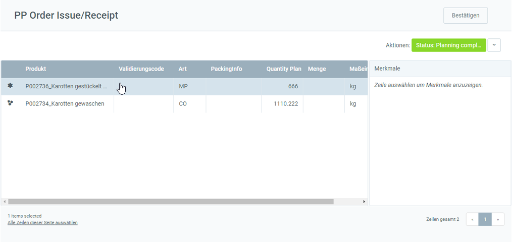
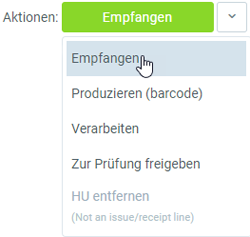
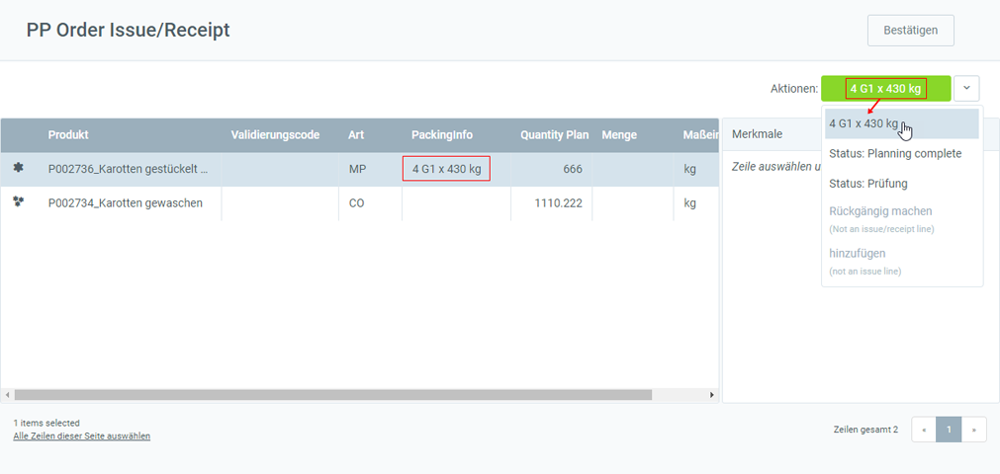
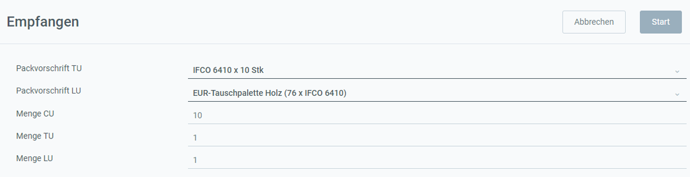
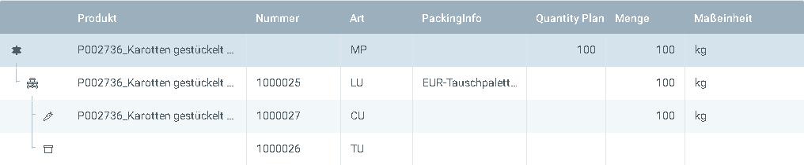
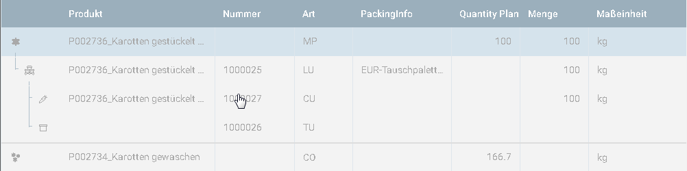
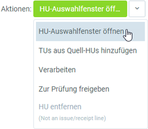
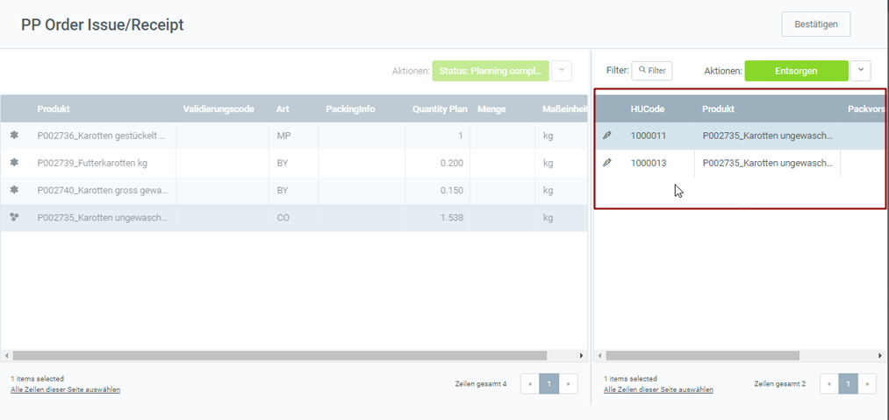
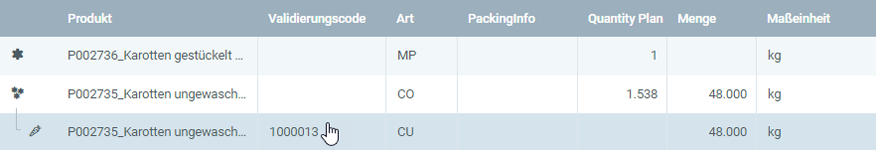

## Überblick
metasfresh bietet zwei Möglichkeiten, den Materialverbrauch bei der Produktion zu protokollieren:
1. Ein Produkt herstellen, ohne Material zu verbrauchen.
1. Ein Produkt herstellen und Materialverbrauch protokollieren.

## Voraussetzungen
- Stelle sicher, dass Du diejenigen Produkte, die Du bei der Produktion verbrauchst, vorher auch auf Lager hast. 
[Hier](Zu_Bestellung_Wareneingang_erstellen) kannst Du nachlesen, wie Du einen Wareneingang erstellst.

## Schritte
1. Öffne den Eintrag eines [fertiggestellten Produktionsauftrags](NeuerProduktionsauftrag).
1. [Starte die Aktion](AktionStarten) "Produzieren". Es öffnet sich ein Overlay-Fenster, das Produktionsfenster.
 >**Hinweis:** Hast Du den Produktionsauftrag in der [Listenansicht](Ansichten) selektiert, kannst Du ebenfalls über den [Quick-Actions](AktionStarten)-Button oben rechts die Aktion  starten.

### a) Produkt herstellen, ohne Material zu verbrauchen
Dies ist die einfachste Möglichkeit in metasfresh zu produzieren. Hierbei wird die produzierte Menge einfach dem Bestand zugebucht, ohne dass die benötigten Stücklistenkomponenten abgebucht werden.

1. [Selektiere](AuswahlBelege) im Produktionsfenster das Produkt (**MP**), welches Du herstellen möchtest, z.B. "Karotten gestückelt".
 

1. [Starte die Quick-Action](AktionStarten) "Empfangen". 
  
 >**Hinweis:** Wurde dem Produkt eine Packvorschrift zugewiesen, erscheint diese auf dem Quick-Actions-Button anstelle von "Empfangen".
  

1. Es öffnet sich ein weiteres Overlay-Fenster.
 

1. ***Optional:*** Wähle eine **Packvorschrift TU** aus.
1. ***Optional:*** Wähle eine **Packvorschrift LU** aus.
1. Trage in das Feld **Menge CU** die empfangene Menge des Produktes ein.
1. Trage in das Feld **Menge TU** die Anzahl der Transporteinheiten ein.
 >**Hinweis 1:** Das Feld **Menge TU** erscheint nur, wenn auch eine **Packvorschrift TU** ausgewählt wurde.  
 >**Hinweis 2:** Die Menge TU muss ***mindestens 1*** betragen.

1. Trage in das Feld **Menge LU** die Anzahl der Ladehilfsmittel ein.
 >**Hinweis 1:** Das Feld **Menge LU** erscheint nur, wenn auch eine **Packvorschrift LU** ausgewählt wurde.  
 >**Hinweis 2:** Das Feld **Packvorschrift LU** erscheint nur, wenn auch eine **Packvorschrift TU** ausgewählt wurde.  
 >**Hinweis 3:** Die Menge LU muss ***mindestens 1*** betragen.

1. Klicke auf "Start", um die empfangenen HUs zu erfassen und das Overlay-Fenster zu schließen.
1. Nach erfolgreicher Zuordnung werden die empfangenen HUs unterhalb des herzustellenden Produktes aufgelistet:
 
  >**Hinweis:** Möchtest Du die Zuordnung rückgängig machen, wähle einfach die hinzugefügte HU aus, gehe zum Quick-Actions-Button und klicke auf "HU entfernen".

1. [Starte die Quick-Action](AktionStarten) "Verarbeiten", um die Materialbuchung vorzunehmen. Dadurch werden die Zeilen schreibgeschützt:
 

1. Klicke auf "Bestätigen", um das Produktionsfenster zu schließen.

## Beispiel 1

---

### b) Produkt herstellen und Materialverbrauch protokollieren
Hierbei werden die für die Produktion benötigten Stücklistenkomponenten vom Bestand abgebucht. Die Zubuchung der produzierten Menge erfolgt wie oben beschrieben.

1. [Selektiere](AuswahlBelege) im Produktionsfenster die Stücklistenkomponente (**CO**), welche Du vom Bestand abbuchen möchtest, z.B. "Karotten ungewaschen".
 

1. [Starte die Quick-Action](AktionStarten) "HU-Auswahlfenster öffnen". 
 

1. Es öffnet sich eine Übersicht auf der rechten Seite mit den passenden Handling Units (HU) vom Lager.
 

1. [Selektiere](AuswahlBelege) die HU, welche für die Produktion verbraucht werden soll.
1. [Starte die Quick-Action](AktionStarten) "Komplette HUs hinzufügen".
1. Nach erfolgreicher Zuordnung siehst Du die hinzugefügte HU unterhalb der Komponente.

 >**Hinweis:** Möchtest Du die Abbuchung rückgängig machen, wähle einfach die hinzugefügte HU aus und starte die Quick-Action "HU entfernen".

1. [Starte die Quick-Action](AktionStarten) "Verarbeiten", um die Abbuchung vorzunehmen. Dadurch werden die Zeilen schreibgeschützt:
 

1. Klicke auf "Bestätigen", um das Produktionsfenster zu schließen.

## Beispiel 2

