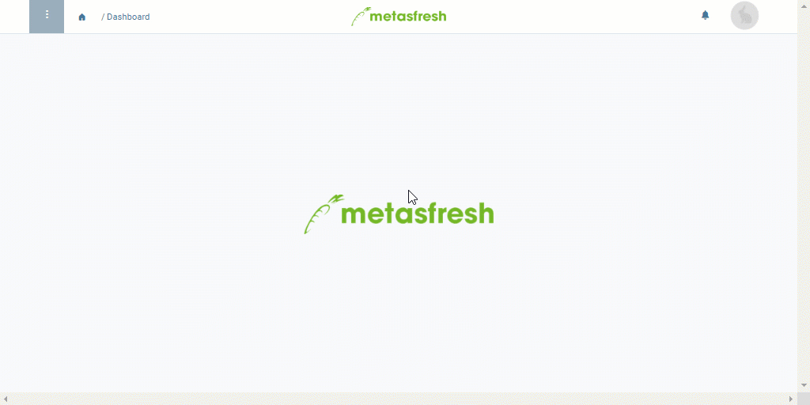

## Übersicht
In metasfresh kannst Du Produktpreise samt allen Details duplizieren, um für minimale Änderungen nicht alle Daten von Neuem erfassen zu müssen, z.B. in Fällen, in denen Du dasselbe Produkt auf einer Preisliste mit unterschiedlichen Packvorschriften hinterlegen möchtest. Dabei wird der duplizierte (geklonte) Produktpreis vorerst als "üngültig" gekennzeichnet, damit bei der Preiskalkulation keine Konflikte aufgrund der Duplikate auftreten. Sobald der geklonte Produktpreis angepasst wurde, kannst Du ihn manuell revalidieren, woraufhin er von der Preiskalkulation wieder normal berücksichtigt wird.

## Schritte

### Produktpreis klonen
1. [Gehe ins Menü](Menu) und öffne das Fenster "Produkt Preise".
1. [Klone den Eintrag eines bestehenden Produktpreises](Klonen_Datensatz_Fenster). Der geklonte Produktpreis wird vorerst von der Preiskalkulation ignoriert.  

### Produktpreis manuell revalidieren
1. Passe den geklonten Produktpreis mit den für ihn vorgesehenen Änderungen an, z.B. durch Änderung der Packvorschrift.
1. Entferne das Häkchen bei **Preis ignorieren**.
1. [metasfresh speichert automatisch](Speicheranzeige).

## Beispiel

