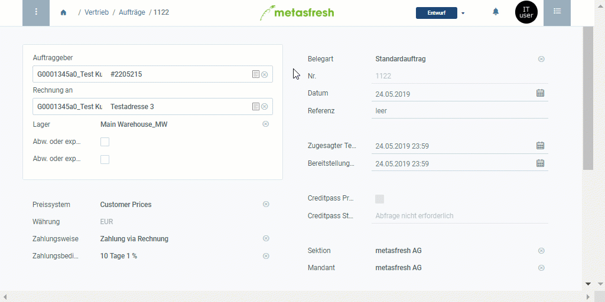

## Überblick
Die Liste der Produktvorschläge dient dazu, eine Übersicht aller Produkte auf einer aktuell gültigen Preisliste zu erhalten. Gleichfalls lässt sich schnell und einfach vergleichen, zu welchen Preisen ein bestimmtes Produkt aus der Preisliste mit anderen Geschäftspartnern gehandelt wird. Darüber hinaus ist es möglich, noch während der Auftrags- oder Bestellerfassung neue Produkte zur Preisliste hinzuzufügen oder ausgediente daraus zu entfernen.

Um mithilfe der Liste der Produktvorschläge einen Auftrag oder eine Bestellung zu erfassen, gehe wie folgt vor:

## Schritte

### Auftrag erfassen
1. [Rufe die Liste der Produktvorschläge im Auftrag auf](Produktvorschlaege_aufrufen).
1. Suche Dir aus den Produktvorschlägen das Produkt Deiner Wahl heraus und gib in das Feld in der Spalte **Menge** eine Produktmenge ein. Bestätige mit `↵ Enter`.
 >**Hinweis:** Wiederhole diese Vorgehensweise für weitere Produkte, die Du zum Auftrag hinzufügen möchtest.

1. ***Optional:*** Passe den Produktpreis an, indem Du doppelt auf das Feld in der Spalte **Preis** klickst und einen anderen Wert eingibst. Bestätige mit `↵ Enter`.
1. Klicke auf "Bestätigen", um die Liste der Produktvorschläge zu schließen und die ausgewählten Produkte mit der angegebenen Menge zur Auftragsposition hinzuzufügen.
1. Fahre fort mit den restlichen Schritten der [Auftragserfassung](Auftrag_erfassen).

### Bestellung erfassen
1. [Rufe die Liste der Produktvorschläge in der Bestellung auf](Produktvorschlaege_aufrufen).
1. Suche Dir aus den Produktvorschlägen das Produkt Deiner Wahl heraus und gib in das Feld in der Spalte **Menge** eine Produktmenge ein. Bestätige mit `↵ Enter`.
 >**Hinweis:** Wiederhole diese Vorgehensweise für weitere Produkte, die Du zur Bestellung hinzufügen möchtest.

1. ***Optional:*** Passe den Produktpreis an, indem Du doppelt auf das Feld in der Spalte **Preis** klickst und einen anderen Wert eingibst. Bestätige mit `↵ Enter`.
1. Klicke auf "Bestätigen", um die Liste der Produktvorschläge zu schließen und die ausgewählten Produkte mit der angegebenen Menge zur Bestellposition hinzuzufügen.
1. Fahre fort mit den restlichen Schritten der [Bestellerfassung](Bestellung_erfassen).

## Nächste Schritte (optional)
- [Verwende die Liste der Produktvorschläge, um Produktpreise und Preislisten direkt aus dem Auftrag/der Bestellung zu editieren](Produktvorschlaege_Preise_editieren).
- [Füge einer Preisliste über die Produktvorschläge Produkte hinzu](Produktvorschlaege_Produkte_hinzufuegen).
- [Entferne Produkte aus einer Preisliste über die Produktvorschläge](Produktvorschlaege_Produkte_entfernen).
- [Verwende die Liste der Produktvorschläge, um die Produktpreise für verschiedene Geschäftspartner miteinander zu vergleichen](Produktvorschlaege_Preisvergleich).

## Beispiel

