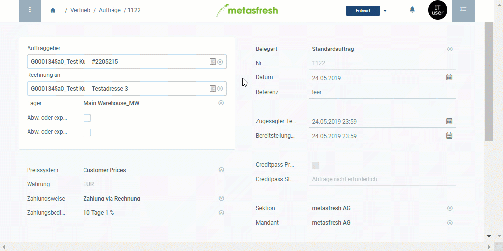

## Überblick
Die Liste der Produktvorschläge kannst Du unter [Aufträge](Auftrag_erfassen), [Bestellungen](Bestellung_erfassen) und [Geschäftspartner](Neuer_Geschaeftspartner) aufrufen. Sie bietet Dir die Möglichkeit, Produktpreise für verschiedene Geschäftspartner miteinander zu vergleichen sowie Preise und Preislisten ohne Umwege über die jeweiligen Menüpunkte zu editieren.

## Schritte

### Produkte aus Preisliste entfernen (*nur in Aufträgen und Bestellungen*)
1. [Rufe die Liste der Produktvorschläge auf](Produktvorschlaege_aufrufen).
1. [Selektiere](AuswahlBelege) die Zeilen der Produkte, die Du aus der aktuellen Preisliste entfernen möchtest.
1. [Starte die Quick-Action](AktionStarten#quick-actions) "Löschen".
1. Es öffnet sich ein Overlay-Fenster, in dem Du gefragt wirst, ob Du den Datensatz wirklich löschen möchtest.
1. Klicke auf "Start", um zu bestätigen und die Produkte aus der Preisliste zu entfernen.

### Speichern und fortfahren
1. Klicke auf "Bestätigen", um die Änderungen zu übernehmen und die Liste der Produktvorschläge zu schließen.
1. Fahre fort mit den restlichen Schritten der [Auftragserfassung](Auftrag_erfassen) oder [Bestellerfassung](Bestellung_erfassen), falls erforderlich.

## Nächste Schritte (optional)
- [Verwende die Liste der Produktvorschläge bei der Auftrags- oder Bestellerfassung](Produktvorschlaege_Auftrag_Bestellung).
- [Verwende die Liste der Produktvorschläge, um Produktpreise und Preislisten direkt aus dem Auftrag/der Bestellung zu editieren](Produktvorschlaege_Preise_editieren).
- [Füge einer Preisliste über die Produktvorschläge Produkte hinzu](Produktvorschlaege_Produkte_hinzufuegen).
- [Verwende die Liste der Produktvorschläge, um die Produktpreise für verschiedene Geschäftspartner miteinander zu vergleichen](Produktvorschlaege_Preisvergleich).

## Beispiel

