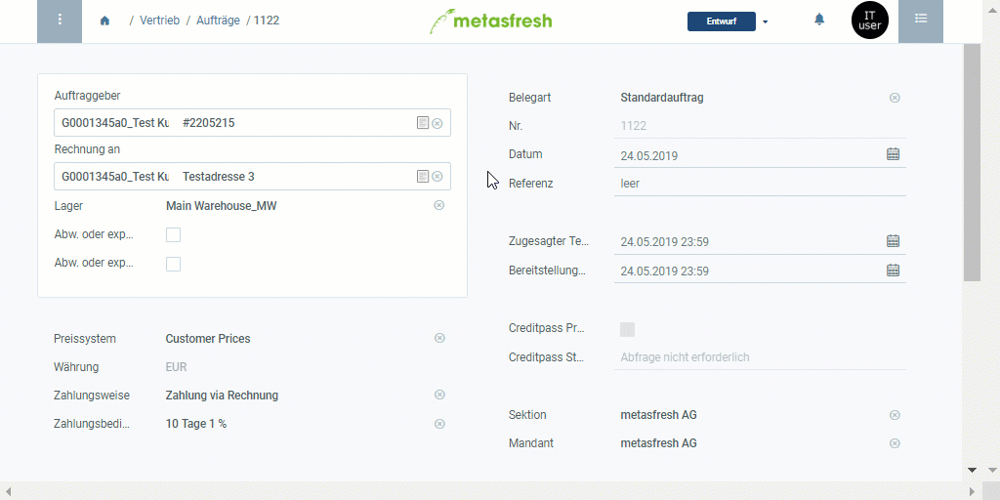

## Überblick
Die Liste der Produktvorschläge kannst Du unter [Aufträge](Auftrag_erfassen), [Bestellungen](Bestellung_erfassen) und [Geschäftspartner](Neuer_Geschaeftspartner) aufrufen. Sie bietet Dir die Möglichkeit, Produktpreise für verschiedene Geschäftspartner miteinander zu vergleichen sowie Preise und Preislisten ohne Umwege über die jeweiligen Menüpunkte zu editieren.

## Schritte

### Andere Produkte anzeigen und zur Preisliste hinzufügen
1. [Rufe die Liste der Produktvorschläge auf](Produktvorschlaege_aufrufen).
1. [Starte die Quick-Action](AktionStarten) "Andere Produkte". Es werden Dir alle Produkte aus der Basispreisliste angezeigt.
1. [Selektiere](AuswahlBelege) die Zeilen der Produkte, die Du der aktuellen Preisliste hinzufügen möchtest.
1. [Starte die Quick-Action](AktionStarten) "Produkte hinzufügen". Nun wurden die selektierten Produkte zur Liste der Produktvorschläge hinzugefügt.
1. [Selektiere](AuswahlBelege) die Zeilen der neu hinzugefügten Produkte.
1. [Starte die Quick-Action](AktionStarten) "Speichern". Nun wurden die neuen Produkte in die jeweilige Preisliste aufgenommen.

### Speichern und fortfahren
1. Klicke auf "Bestätigen", um die Änderungen zu übernehmen und die Liste der Produktvorschläge zu schließen.
1. Fahre fort mit den restlichen Schritten der [Auftragserfassung](Auftrag_erfassen) oder [Bestellerfassung](Bestellung_erfassen), sofern nötig.

## Nächste Schritte (optional)
- [Verwende die Liste der Produktvorschläge bei der Auftrags- oder Bestellerfassung](Produktvorschlaege_Auftrag_Bestellung).
- [Verwende die Liste der Produktvorschläge, um Produktpreise und Preislisten direkt aus dem Auftrag/der Bestellung zu editieren](Produktvorschlaege_Preise_editieren).
- [Entferne Produkte aus einer Preisliste über die Produktvorschläge](Produktvorschlaege_Produkte_entfernen).
- [Verwende die Liste der Produktvorschläge, um die Produktpreise für verschiedene Geschäftspartner miteinander zu vergleichen](Produktvorschlaege_Preisvergleich).

## Beispiel

