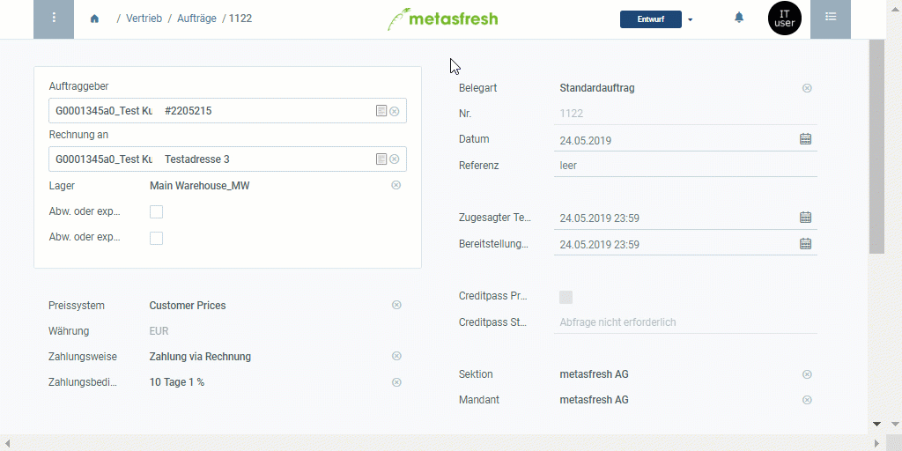

## Überblick
Die Liste der Produktvorschläge dient dazu, eine Übersicht aller Produkte auf einer aktuell gültigen Preisliste zu erhalten. Gleichfalls lässt sich schnell und einfach vergleichen, zu welchen Preisen ein bestimmtes Produkt aus der Preisliste mit anderen Geschäftspartnern gehandelt wird. Darüber hinaus ist es möglich, noch während der Auftrags- oder Bestellerfassung neue Produkte zur Preisliste hinzuzufügen oder ausgediente daraus zu entfernen.

Die Liste der Produktvorschläge kannst Du unter [Aufträge](Auftrag_erfassen), [Bestellungen](Bestellung_erfassen) und [Geschäftspartner](Neuer_Geschaeftspartner) aufrufen. Gehe hierzu wie folgt vor:

## Schritte

### In Aufträgen
1. Folge dieser [Anleitung zur Erfassung eines Auftrages](Auftrag_erfassen) bis zur **Auftragszeileneingabe**.
1. Gehe zur Registerkarte "Auftragsposition" unten auf der Seite und klicke auf , um die Liste der Produktvorschläge zu öffnen.
 >**Hinweis:** Drücke `Alt` + `Z` / `⌥ alt` + `Z`.

### In Bestellungen
1. Folge dieser [Anleitung zur Erfassung einer Bestellung](Bestellung_erfassen) bis zur **Bestellzeileneingabe**.
1. Gehe zur Registerkarte "Bestellposition" unten auf der Seite und klicke auf , um die Liste der Produktvorschläge zu öffnen.
 >**Hinweis:** Drücke `Alt` + `Z` / `⌥ alt` + `Z`.

### In Geschäftspartnereinträgen
1. Öffne den Eintrag eines bestehenden [Geschäftspartners](Menu) in der [Einzelansicht](Ansichten) bzw. [lege einen neuen an](Neuer_Geschaeftspartner).
1. [Starte die Aktion](AktionStarten) "Produktvorschläge". Es öffnet sich ein Overlay-Fenster mit der Liste der Produktvorschläge.

## Nächste Schritte
- [Verwende die Liste der Produktvorschläge bei der Auftrags- oder Bestellerfassung](Produktvorschlaege_Auftrag_Bestellung).
- [Verwende die Liste der Produktvorschläge, um Produktpreise und Preislisten direkt aus dem Auftrag/der Bestellung zu editieren](Produktvorschlaege_Preise_editieren).
- [Füge einer Preisliste über die Produktvorschläge Produkte hinzu](Produktvorschlaege_Produkte_hinzufuegen).
- [Entferne Produkte aus einer Preisliste über die Produktvorschläge](Produktvorschlaege_Produkte_entfernen).
- [Verwende die Liste der Produktvorschläge, um die Produktpreise für verschiedene Geschäftspartner miteinander zu vergleichen](Produktvorschlaege_Preisvergleich).

## Beispiel

