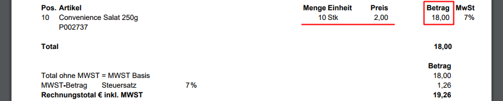
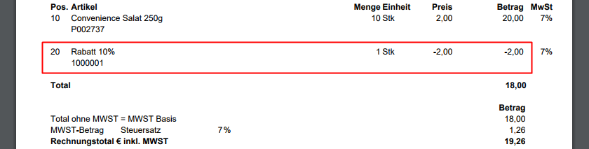

## Übersicht
Die Rabattschemata in metasfresh sind sehr flexibel und vielfältig einsetzbar. Sie können auf einzelne Produkte oder ganze Produktkategorien angewendet werden, als Staffel- und Gruppenrabatte konfiguriert und Geschäftspartnern individuell zugeordnet werden.

Außerdem lassen sich die verschiedenen Rabattformen intelligent miteinander kombinieren, können manuell gewährt oder auch als automatische Rabattschemata konfiguriert werden.

Rabatte finden ihre Anwendung bei der Auftragszeilenerfassung eines [Auftrags](Auftrag_erfassen) oder auch einer [Bestellung](Bestellung_erfassen). 
Es gibt folgende Rabattformen:

## Auftragszeilenrabatte
Der [Auftragszeilenrabatt](Auftragszeilenrabatt) wird pro Auftragszeile einzeln vergeben und nicht separat als Rabatt ausgewiesen. Er reduziert lediglich den Preis des Produktes und ist somit auf dem Beleg nur im verringerten Rechnungsbetrag erkennbar.

### Beispiel

---

## Auftragszeilengruppenrabatte (Kompensationsgruppen)
Mit dem [Auftragszeilengruppenrabatt](Auftragszeilengruppenrabatt) kannst Du beliebig viele Auftragszeilen zu einer *Kompensationsgruppe* zusammenfassen, für die der Rabatt gelten soll. Dieser Gruppenrabatt wird dann als separate Rabattzeile ausgewiesen und erscheint auch als solche auf dem Beleg. Du kannst beliebig viele Kompensationsgruppen in einem Auftrag bilden, allerdings kann eine Rabattzeile nur jeweils einer Kompensationsgruppe angehören.

### Beispiel

---

## Automatisches Mengenrabattschema (Staffelrabatt)
Mittels des [automatischen Mengenrabattschemas](Automatischer_Mengenrabatt) kannst Du bestimmte Rabattkonditionen, wie z.B. **Staffelrabatte (Mengennachlässe)** für einzelne Produkte oder ganze Produktkategorien vorkonfigurieren und einem Geschäftspartner oder einer Gruppe zuweisen.

Werden diese Rabattkonditionen in einer von diesem Geschäftspartner beauftragten Bestellung erfüllt, werden die Rabatte automatisch angewendet.
