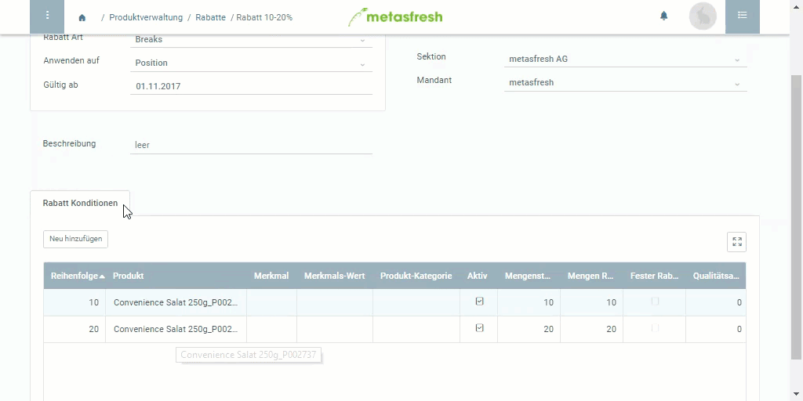

## Überblick
Damit ein [Rabattschema](Rabattschema_anlegen) automatisch angewandt wird, muss es erst mit einem Geschäftspartner verknüpft werden, für den das Rabattschema gelten soll.

## Schritte
1. Öffne den Eintrag eines bestehenden [Geschäftspartners](Menu) bzw. [lege einen neuen an](Neuer_Geschaeftspartner).
1. Gehe zur Registerkarte "Kunde" unten auf der Seite und bewege die horizontale Bildlaufleiste nach rechts, bis Du die Spalte **Rabattschema** erreichst.
1. Klicke doppelt auf das Feld **Rabattschema** der Kundenzeile und wähle aus der Dropdown-Liste das gewünschte Rabattschema aus.
1. [metasfresh speichert automatisch](Speicheranzeige).

## Beispiel

