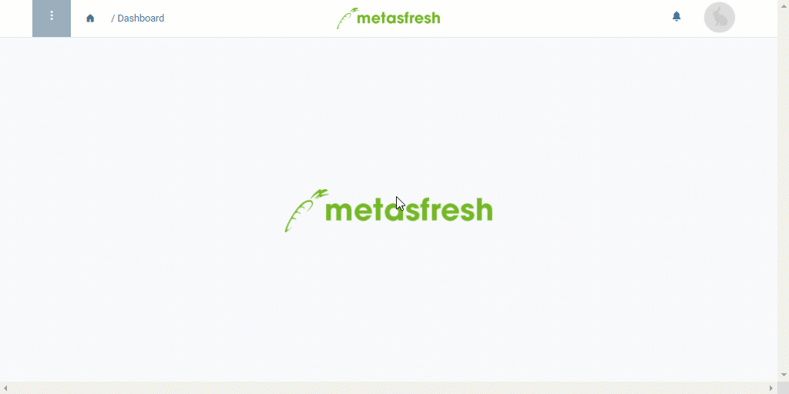

## Voraussetzungen
- [Lege ein Rabattschema an](Rabattschema_anlegen), in das Rabattzeilen aus anderen bestehenden Rabattschemata übertragen werden sollen.

## Schritte
1. [Gehe ins Menü](Menu) und öffne das Fenster "Rabatte Zeilen". Hier werden alle Rabattzeilen aus allen existierenden Rabattschemata aufgelistet.
1. ***Optional:*** [Verwende die Filterfunktion](Filterfunktion), um die [Listenansicht](Ansichten) nach ganz bestimmten Rabattzeilen zu filtern.
1. [Selektiere](AuswahlBelege) die Rabattzeilen, die Du kopieren möchtest.
1. [Starte die Quick-Action](AktionStarten) "Rabatte Zeilen Kopieren". Es öffnet sich ein Overlay-Fenster.
 >**Hinweis:** Diese Aktion findest Du ebenfalls im Aktionsmenü in der Listenansicht.

1. Wähle das **Rabattschema** aus, in das die selektierten Rabattzeilen übertragen werden sollen.
1. Klicke auf "Start", um die Rabattzeilen zu kopieren und das Overlay-Fenster zu schließen.
1. [metasfresh speichert automatisch](Speicheranzeige).

| **Hinweis:** |
| :--- |
| Das Rabattschema mit den kopierten Rabattzeilen kannst Du unter dem Menüpunkt "[Rabatte](Menu)" einsehen. |

## Beispiel

