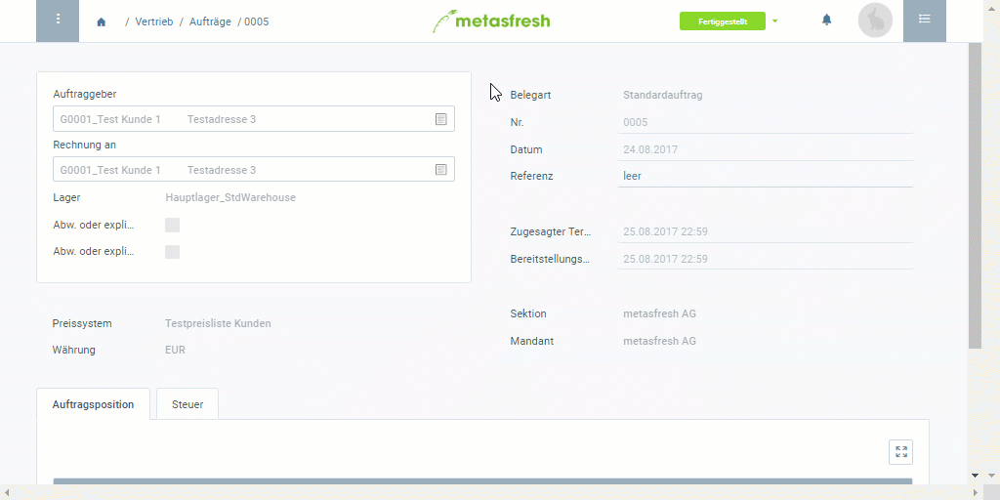

## Schritte
1. [Gehe ins Menü](Menu) und öffne das Fenster "Aufträge".
1. Öffne den Eintrag eines [fakturierten](Zu_Auftrag_Rechnung_erstellen) [Auftrags](Auftrag_erfassen), dessen Rechnung Du stornieren möchtest.
1. [Springe zur](SpringezuBelegen) "Rechnung" des Auftrags und öffne den entsprechenden Eintrag unter "[Debitoren Rechnungen](Menu)".
1. Öffne das [Belegverarbeitungsmenü](AktionStarten) (`Alt` + `I` / `⌥ alt` + `I`) und klicke auf *Storno*. Die Rechnung wurde nun rückgängig gemacht. 

1. [metasfresh speichert automatisch](Speicheranzeige).

## Beispiel

