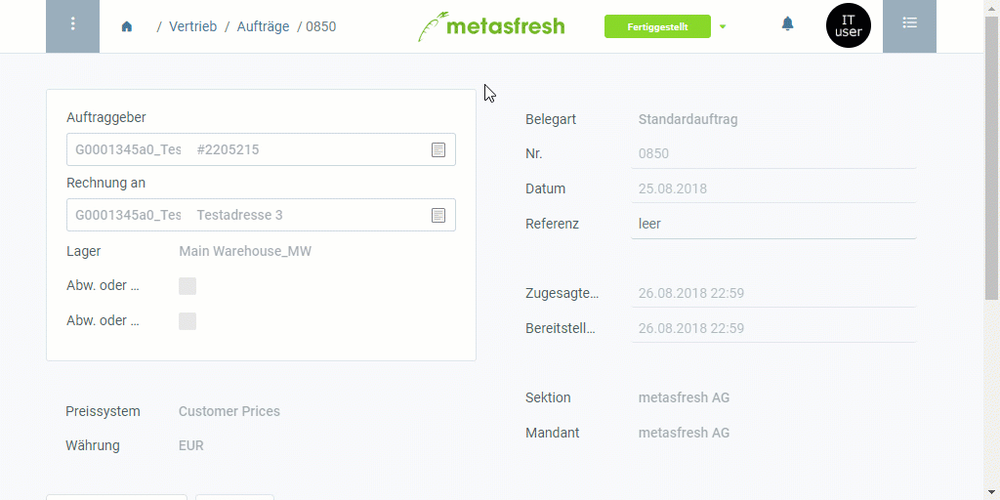

## Überblick
Rechnungsspezifische Texte können nur im Eintrag einer fertiggestellten Rechnung erfasst werden und erscheinen anschließend auch nur auf dem entsprechenden Rechnungsbeleg.

Weitere Informationen darüber, wie Du eigenen Text in Belege einfügen kannst, gibt es [hier](Text_auf_Belege_drucken-allgemein).

## Schritte
1. [Gehe ins Menü](Menu) und öffne das Fenster "Debitoren Rechnungen".
1. Öffne den Eintrag einer [fertiggestellten Ausgangsrechnung](Zu_Auftrag_Rechnung_erstellen). [Verwende die Filterfunktion](Filterfunktion), um Dir bei der Suche nach einer ganz bestimmten Rechnung zu helfen.
 >**Hinweis:** Du kannst auch über die [verknüpften Belege](SpringezuBelegen) eines [fertiggestellten](BelegverarbeitungFertigstellen) [Auftrages](Auftrag_erfassen) ***direkt*** zum dazugehörigen Rechnungsbeleg springen, den Du bearbeiten möchtest.

1. Öffne die "[Erweiterte Erfassung](Ansichten)" aus dem [Aktionsmenü](AktionStarten).
 >**Hinweis:** Drücke `Alt` + `E` / `⌥ alt` + `E`.

1. Scrolle runter bis zum Textfeld **Beschreibung** und gib hier einen Text ein, der am Anfang des Beleges erscheinen soll.
1. Gib in das Textfeld **Schlusstext** einen Text ein, der am Ende des Beleges erscheinen soll.
1. Klicke auf "Bestätigen", um die Änderungen zu übernehmen und die "Erweiterte Erfassung" zu schließen.
1. [Öffne die PDF-Vorschau](PDFVorschau).

## Beispiel

