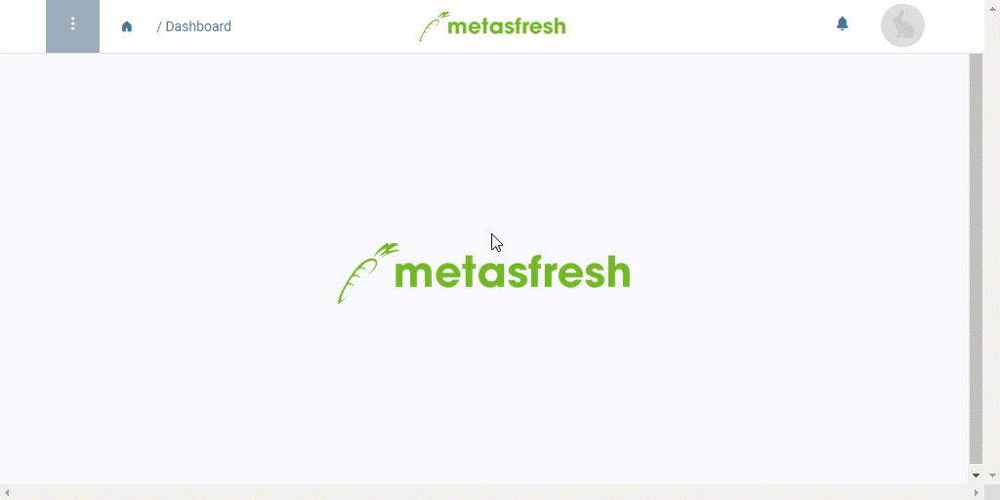

## Schritte
1. [Gehe ins Menü](Menu) und öffne das Fenster "Saldobilanz". Es öffnet sich ein Overlay-Fenster.
1. Wähle ein **Datum** aus, für das Du eine Saldenbilanz erstellen möchtest.
1. Klicke auf "Start", um die Bilanz zu erstellen und das Overlay-Fenster zu schließen.
1. Es öffnet sich eine PDF-Datei, in der Du die Saldenbilanz einsehen und welche Du auf Deinem Gerät speichern kannst.

## Beispiel

