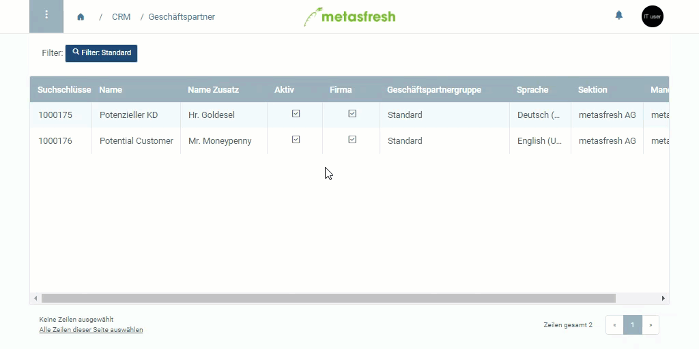

## Schritte
1. Öffne den Eintrag eines bestehenden [Geschäftspartners](Menu) bzw. [lege einen neuen an](Neuer_Geschaeftspartner).
1. Gehe zur Registerkarte "Kunde" unten auf der Seite.
1. Öffne die "[Erweiterte Erfassung](AdvancedEditTab_Öffnen)" der Kundenzeile.
1. Stelle im Feld **Aggregationsregel für Ausgangsrechnung** die gewünschte Aggregation ein.
 >**Hinweis:** Im Normalfall "invoicing-agg-std" wählen.

1. Klicke auf "Bestätigen", um die "Erweiterte Erfassung" zu schließen.

## Erläuterung der Regeln
| Regel | Bezeichnung | Erläuterung |
|---|---|---|
| invoicing-agg-std | Standardregel | Zusammenfassung erfolgt ohne Einschränkungen |
| leer | | Pro Auftrag wird immer eine Rechnung erstellt |

## Beispiel

