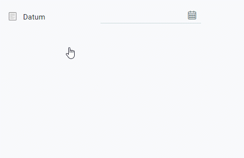
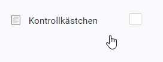
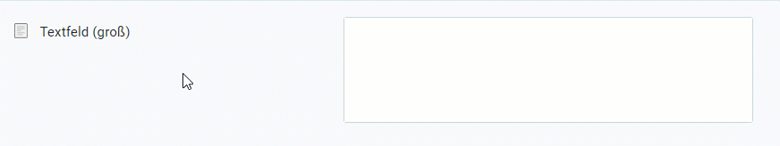
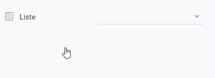
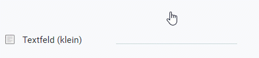
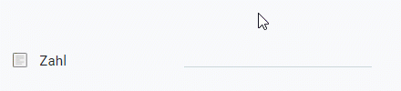

## Voraussetzungen
- [Füge einem Unterregister Sektionen mit Sektionszeilen hinzu](Unterregister_Sektion_hinzufuegen).

## Schritte

### Feld hinzufügen
1. [Gehe ins Menü](Menu) und öffne das Fenster "Erweiterte Dateneingabe - Feld".
1. [Lege einen neuen Eintrag an](Neuer_Datensatz_Fenster_Webui).
1. Benenne das Feld im Feld **Name**.
 >**Hinweis:** Der Feldname wird an entsprechender Stelle in der Sektionszeile zu lesen sein.

1. Gib im Feld **Zeile** einen Teil des (systeminternen) Namens der [Sektion](Unterregister_Sektion_hinzufuegen) ein, in der sich die Zeile befindet, in der das Feld erscheinen soll, und klicke auf den passenden Treffer in der [Dropdown-Liste](Keyboard_Shortcuts_Liste).
 >**Hinweis 1:** Die Reihenfolge der Zeile steht am Ende der Trefferbezeichnung.  
 >**Hinweis 2:** Bei mehreren Feldern für dieselbe Sektionszeile kannst Du deren **Reihenfolge** bestimmen.

1. Wähle einen **Datentyp** aus, z.B. *Datum*, *Ja-Nein*, *Langtext*, *Liste*, *Text* oder *Zahl*.
 >**Hinweis:** Bei Auswahl des Datentyps *Liste* müssen zusätzlich Listenelemente erfasst werden, die anschließend in der Liste vorgeschlagen und ausgewählt werden können (siehe unten).

1. ***Optional:*** Erfasse eine **Beschreibung** in dem dafür vorgesehenen Textfeld.
 >**Hinweis:** Diese Beschreibung wird als Tooltip angezeigt werden.

1. ***Optional:*** Setze ein Häkchen bei **Pflichtangabe**, wenn es sich um ein Pflichtfeld handeln soll.
1. ***Optional:*** Entferne das Häkchen bei **In API verfügbar**, wenn das Feld nicht via metasfresh API für externe Anwendungen verfügbar sein soll.
1. Wähle eine **Datenschutz-Kategorie** aus, z.B. *Keine personenbezogene Daten*, *Personenbezogene Daten* oder *Sensible Daten*.

### Listenelemente erfassen (Datentyp: *Liste*)
1. Gehe zur Registerkarte "DataEntry_ListValue" unten auf der Seite und klicke auf . Es öffnet sich ein Overlay-Fenster.
1. Benenne das Listenelement im Feld **Name**.
1. ***Optional:*** Erfasse eine **Beschreibung** in dem dafür vorgesehenen Textfeld.
 >**Hinweis:** Diese Beschreibung wird als Tooltip angezeigt werden.

1. Klicke auf "Bestätigen", um das Overlay-Fenster zu schließen und das Listenelement zur Liste hinzuzufügen.
 >**Hinweis 1:** Wiederhole die Schritte 1 bis 4, um weitere Listenelemente hinzuzufügen.  
 >**Hinweis 2:** Bei mehreren Listenelementen kannst Du deren **Reihenfolge** bestimmen.

## Nächste Schritte (optional)
- [Erstelle ein benutzerdefiniertes Produktetikett](Produktetikett_erstellen).

## Übersicht der Felder

| Datentyp | Beispiel |
| :--- | :---: |
| *Datum* |  |
| *Ja-Nein* |  |
| *Langtext* |  |
| *Liste* |  |
| *Text* |  |
| *Zahl* |  |
