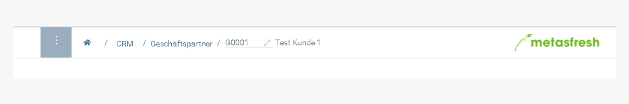

## Übersicht

metasfresh speichert prinzipiell überall vollautomatisch in dem Moment wo sich Daten geändert haben.

| Farbanzeige     | Aussage    |
| :------------- | :------------- |
| grau       | versucht gerade zu speichertn       |
| grün |  erfolgreich gespeichert|
| rot | aufgrund eines Fehlers nicht gespeichert

## Video

