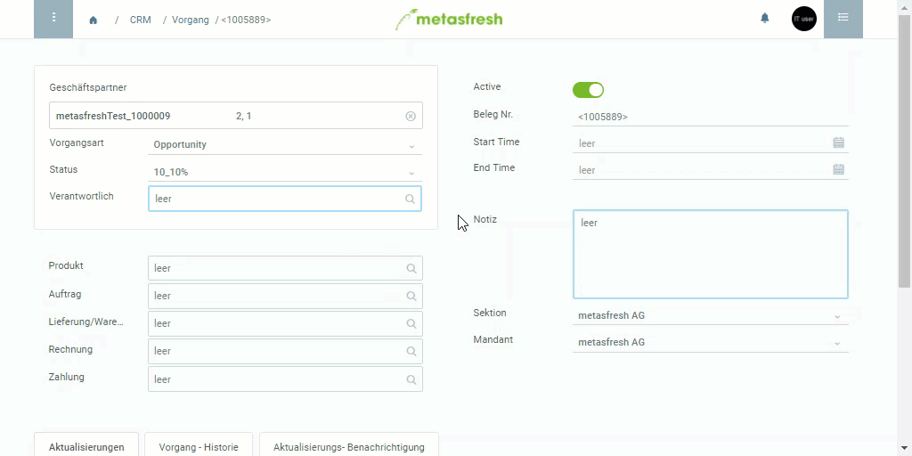

## Übersicht
Möchtest Du den Inhalt eines Feldes einsehen und gegebenenfalls bearbeiten, brauchst Du nicht den Umweg über das Navigationsmenü zu gehen und nach dem Eintrag zu suchen, sondern kannst direkt über das Feld dorthin springen.

## Springen über ein Feld
1. Öffne ein beliebiges Dokument, z.B. einen [Auftrag](Auftrag_erfassen).
1. Gehe mit dem Mauszeiger über die Bezeichnung des Feldes, zu dessen Inhalt Du springen möchtest, z.B. **Auftraggeber**.
1. Wird die Feldbezeichnung unterstrichen dargestellt, klicke sie an, um in das jeweilige Fenster zu wechseln.
1. Das Fenster wird in einem neuen Tab geöffnet.
 

| **Wichtig!** |
| :- |
| Dieses Feature funktioniert nur bei deaktiviertem Pop-Up-Blocker! |

## Beispiel

