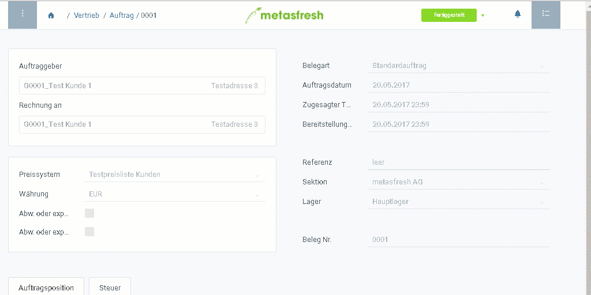

## Springen mit der Sidebar
1. Öffne einen [fertiggestellten Auftrag](Auftrag_erfassen).
1. Drücke `Strg + 5`, um die Sidebar  zu öffnen.
1. Es öffnet sich ein Reiter, der Dir mögliche Verknüpfungen anzeigt.
1. Klicke auf eine Verknüpfung, um dorthin zu springen (z.B. Lieferdisposition).
 

