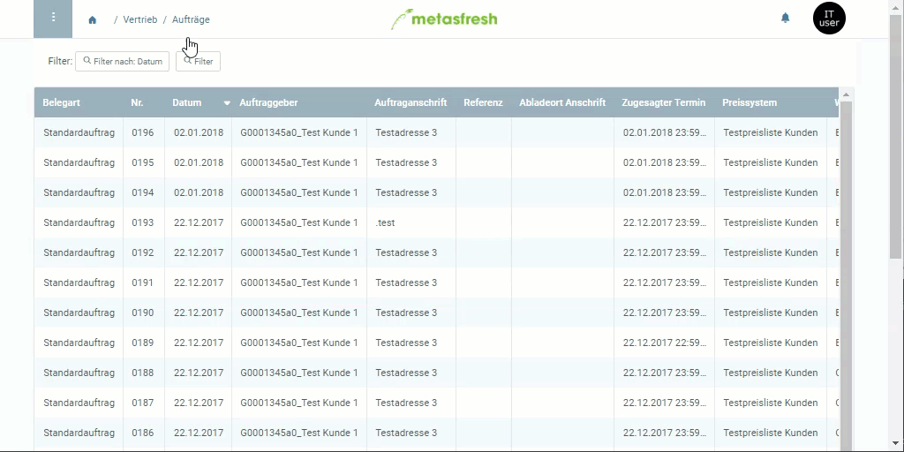

## Überblick
Diese Funktion steht für Registerkarteneinträge zur Verfügung und bietet eine weitere Möglichkeit, schnell zu verknüpften Daten zu gelangen.

## Springen über das Kontextmenü
1. [Öffne ein Dokument](Menu) Deiner Wahl, z.B. einen [Auftrag](Auftrag_erfassen).
1. Gehe zu einer Registerkarte unten auf der Seite, z.B. "Auftragsposition".
1. Gehe mit dem Mauszeiger über eine Zeile und öffne mit einem Rechtsklick das Kontextmenü.
1. Klicke auf die gewünschte Verknüpfung mit dem Zeichen , um in das jeweilige Fenster zu wechseln.
1. Das Fenster wird in einem neuen Browser-Tab geöffnet.

## Beispiel

