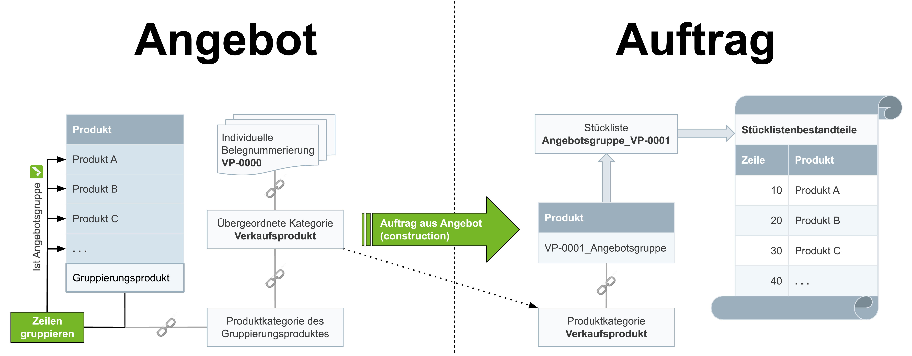

## Übersicht
Hast Du mehrere Produkte, die für die Herstellung eines neuartigen Verkaufsproduktes vorgesehen sind, in einem Angebot zu einer Kompensationsgruppe zusammengefasst und erstellst anschließend daraus einen Auftrag, dann verwandelt metasfresh die Angebotsgruppe automatisch in eine verifizierte Stückliste, woraufhin das neu zusammengestellte Verkaufsprodukt sofort und ohne zusätzlichen Mehraufwand für zukünftige Aufträge zur Verfügung steht. Die jeweiligen Mengen der Bestandteile der Angebotsgruppe werden dabei in derselben Höhe in die Stückliste übernommen.

## Voraussetzungen
- [Richte die automatische Stücklistenerstellung bei Auftragsgenerierung ein](Stueckliste_bei_Auftragsgenerierung_Einrichtung).

## Schritte

### Angebot mit Angebotsgruppe erstellen
1. [Erstelle ein Angebot](Angebot_erstellen) mit den gewünschten Produkten und Mengen, aber stelle es ***noch nicht fertig***.
 >**Hinweis:** Die Produktmengen aus dem Angebot werden bei Auftragsgenerierung in derselben Höhe in die Stückliste übernommen.

1. [Erstelle eine manuelle Kompensationsgruppe (ab **Schritt 2**)](Kompensationsgruppen_manuell_erstellen) mithilfe eines [für die Angebotsgruppierung aktivierten Gruppierungsproduktes](Gruppierungsprodukt_anlegen).
 >**Hinweis 1:** Der Name der Kompensationsgruppe wird später für die Benennung der Stückliste und des dazugehörigen Verkaufsproduktes verwendet.  
 >**Hinweis 2:** Das Gruppierungsprodukt wird als zusätzliche Zeile hinzugefügt und erscheint nicht auf den Folgebelegen.

1. [Stelle das Angebot fertig](BelegverarbeitungFertigstellen).

### Angebot in Auftrag umwandeln
1. [Starte die Aktion](AktionStarten) "Auftrag aus Angebot (construction)". Es öffnet sich ein Overlay-Fenster.
1. Wähle die **Belegart** *Standardauftrag* aus.
1. Klicke auf "Start", um das Overlay-Fenster zu schließen und den Auftrag zu erstellen.

### Neues Verkaufsprodukt und Stückliste ansehen
1. Gehe zur Registerkarte "Auftragsposition" unten auf der Seite des fertiggestellten Auftrages und [zoome](Zoomen_in_Tabellenfeld) in das Feld in der Spalte **Produkt** der Auftragszeile. Es öffnet sich der Eintrag des neuen Produktes in einem neuen Browser-Tab.
1. [Springe über die verknüpften Belege](SpringezuBelegen) des neuen Produktes zur "Stücklistenkonfiguration" (unter PRODUKTVERWALTUNG in der Sidebar) und öffne dort die dazugehörige, bereits [herausgefilterte](Filterfunktion) Stückliste.

## Beispiel

