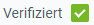

## Überblick
Damit eine Stückliste gültig wird und in der Produktion verwendet werden kann, muss sie vorher verifiziert werden.

## Voraussetzungen
1. [Erstelle eine Stückliste für das zu fertigende Produkt](Stueckliste_erstellen).
1. [Erstelle eine Stücklistenversion](Stuecklistenversion_erstellen).
1. [Erfasse die für die Produktion benötigten Stücklistenbestandteile](Stuecklistenbestandteile_erfassen).

## Schritte
1. [Gehe ins Menü](Menu) und öffne das Fenster "Stückliste Version".
1. Öffne den Eintrag einer bestehenden Stücklistenversion bzw. [lege eine neue an](Stuecklistenversion_erstellen).
1. [Stelle die Stücklistenversion fertig](BelegverarbeitungFertigstellen), sofern noch nicht geschehen.

### Stückliste verifizieren
1. [Starte die Aktion](AktionStarten#aktionsmenue) "Stückliste verifizieren". Es öffnet sich ein Overlay-Fenster.
1. ***Optional:*** Wähle eine [**Produktkategorie**](NeueProduktkategorie) aus.
1. Klicke auf "Start", um zu bestätigen und das Overlay-Fenster zu schließen.
1. [metasfresh speichert automatisch](Speicheranzeige).
1. Um den Verifizierungsstatus der Stückliste zu überprüfen, [springe in das Feld](Springezu) **Produkt** des Eintrages und stelle sicher, dass dort das Kontrollkästchen <kbd></kbd> angehakt ist.

    | **Hinweis:** |
    | :--- |
    | Änderungen an einer Stückliste können nur vorgenommen werden, solange sie noch nicht in der Produktion eingesetzt wurde. Nach jeder Änderung an einer Stückliste muss diese erneut verifiziert werden! |

## Nächste Schritte
- [Lege einen Produktionsauftrag an unter Verwendung einer Stückliste](NeuerProduktionsauftrag).

## Beispiel
<kbd></kbd>
