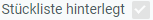

## Voraussetzungen
- [Erstelle eine Stückliste für das zu fertigende Produkt](Stueckliste_erstellen).

## Schritte
1. [Gehe ins Menü](Menu) und öffne das Fenster "Stückliste Version".
1. [Lege eine neue Stücklistenversion an](Neuer_Datensatz_Fenster_Webui).
1. Gib in das Feld **Stückliste** einen Teil des Namens oder der Nummer der [Stückliste](Stueckliste_erstellen) ein, für das Du eine Stücklistenversion erstellen möchtest, und klicke auf den passenden Treffer in der <a href="Keyboard_Shortcuts_Liste#dropdown" title="Dynamisches Suchfeld (Autocomplete)">Dropdown-Liste</a>.
1. Das **Produkt** (Fertigungsprodukt) wird automatisch aus der Stückliste übernommen.
1. Der **Name** der Stücklistenversion wird automatisch aus der Stückliste übernommen und kann an dieser Stelle bearbeitet werden.
1. Wähle eine **Maßeinheit** für das Fertigprodukt aus.
    >**Hinweis:** Stücklisten beziehen sich immer nur auf **einzelne Mengen** (Exemplare/Einzelstücke) des Fertigungsproduktes. Bei Abweichungen der hier ausgewählten Maßeinheit mit der des Fertigungsproduktes muss eine [Maßeinheitenumrechnung](Masseinheiten_umrechnen) definiert werden.

1. Stelle sicher, dass der **Suchschlüssel** der Stücklistenversion und die Artikelnummer des Produktes ***miteinander identisch*** sind.
1. Wähle im Feld **Verwendung** *Produktion* aus.
 >**Hinweis:** Für Handelsstücklisten für Fertigprodukte, die zwar nicht produziert, deren Bestandteile aber trotzdem im Auftrag einzeln aufgeführt werden sollen, wähle *Phantom* aus.

1. Wähle die **Belegart** *Bill of Material Version* (dt.: Stücklistenversion) aus.
1. ***Optional:*** Vergib im Feld **Nr.** eine benutzerdefinierte Belegnummer.
1. Stelle ein **Gültig ab** Datum ein.
 >**Hinweis:** Liegt das Datum in der *Vergangenheit*, ist die Stücklistenversion *ab sofort* gültig. Liegt es in der *Zukunft*, gilt sie *erst ab diesem Datum*.

1. ***Optional:*** Wähle eine **Nummernfolge für Seriennummer** aus. Gib dazu einen Teil des Namens der [Belegnummerierung](Belegnummern_definieren) ein und klicke auf den passenden Treffer in der <a href="Keyboard_Shortcuts_Liste#dropdown" title="Dynamisches Suchfeld (Autocomplete)">Dropdown-Liste</a>.
 >**Hinweis:** Hierzu muss die [Produktkategorie](NeueProduktkategorie) mit einem [**Merkmalssatz**](Merkmalssatz_neu_anlegen) verknüpft sein, in dem das [Merkmal](Merkmal_Produkt_neu_anlegen) *Seriennummer* definiert ist.

1. [metasfresh speichert automatisch](Speicheranzeige). Sobald die Stücklistenversion gespeichert wurde, wird das Kontrollkästchen <kbd></kbd> im Eintrag des verknüpften Fertigungsproduktes aktiviert (schreibgeschützt). Vor Verwendung muss die [Stückliste nun erst noch verifiziert werden](Stueckliste_verifizieren).

#### <a name="zubehörteilstueckliste">Sonderfall: Zubehörteilstückliste</a> (für [re­pa­ra­tur­be­dürf­tige Retouren](Reparaturen_Service_Annahme))
- Wähle die **Stücklisten-Zugehörigkeit** *Zubehörteile* aus.

    | **Tipp:** |
    | :--- |
    | [Klone den Eintrag einer Produktionsstückliste](Klonen_Datensatz_Fenster) und entferne anschließend alle unbenötigten Bestandteile aus der Registerkarte "Stücklistenbestandteile", die keine Zubehörteile sind. Achte beim Klonen lediglich darauf, dass die **Suchschlüssel unterschiedlich** sind. |

## Nächste Schritte
1. [Erfasse die für die Produktion benötigten Stücklistenbestandteile (Komponenten)](Stuecklistenbestandteile_erfassen).
1. [Stelle die Stückliste fertig und verifiziere sie](Stueckliste_verifizieren).

## Beispiel
<kbd></kbd>
