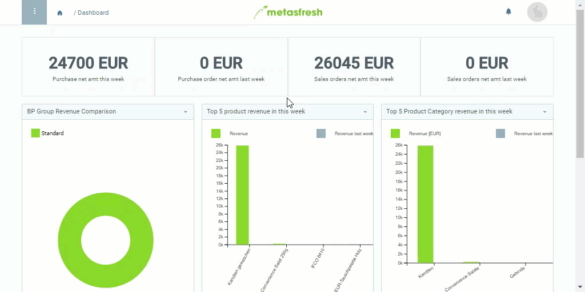

## Schritte
1. Öffne rechts oben in der Menüleiste das Nutzermenü .
 >**Hinweis:** Drücke `Alt` + `4` / `⌥ alt` + `4`.

1. Klicke auf "Einstellungen" bzw. "Settings".
1. Wähle links in dem Fenster eine andere **Sprache** aus.
1. [metasfresh speichert automatisch](Speicheranzeige).

## Beispiel

