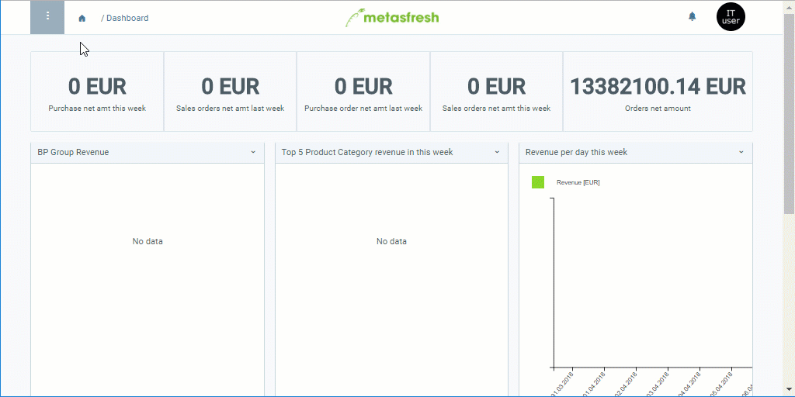

## Übersicht
In metasfresh kannst Du für jede Belegart (z.B. Angebot, Bestellung, Eingangsrechnung, Lieferschein, Standardauftrag usw.) eigene Texte erfassen, die dann bei der Belegerstellung automatisch an den dafür vorgesehenen Stellen auf dem Beleg eingefügt werden. Die Texte können sowohl am Anfang als auch am Ende des Beleges stehen (siehe [dieses Beispiel](Text_auf_Belege_drucken-allgemein)).

Darüber hinaus kannst Du diese Texte auch eigenständig in die Sprachen Deiner Geschäftspartner übertragen, damit beim [Drucken von Belegen](PDFVorschau) für fremdsprachige Geschäftspartner automatisch die in deren Sprachen entsprechend verfassten Texte auf den Belegen aufgeführt werden. Weitere Informationen darüber, wie Du Dateneinträge mehrsprachig verwalten kannst, gibt es [hier](Mehrsprachige_Datenverwaltung).

## Schritte
1. [Gehe ins Menü](Menu) und öffne das Fenster "Belegart".
1. Öffne den Eintrag einer bestehenden Belegart, z.B. "Angebot".
1. Gib in das Textfeld **Beschreibung** einen Text ein, der am Anfang des Beleges erscheinen soll.
1. Gib in das Textfeld **Notiz / Zeilentext** einen Text ein, der am Ende des Beleges erscheinen soll.
1. Stelle sicher, dass bei dem Kontrollkästchen **Copy description to document** ein Häkchen gesetzt ist, damit die Texte auch auf die Belege gedruckt werden.
1. [metasfresh speichert automatisch](Speicheranzeige).

## Nächste Schritte (optional)
- [Übertrage die Belegtexte in die Sprachen Deiner Geschäftspartner](Belegtexte_uebersetzen-Belegart).

## Beispiel

