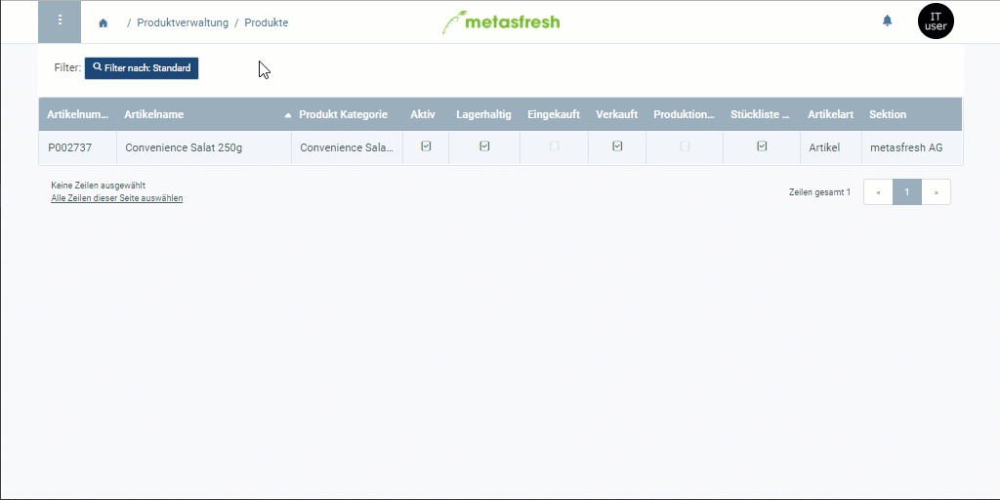

## Übersicht
Der Text einer Produktbeschreibung erscheint auf allen entsprechenden Belegen unterhalb des Produktnamens. Weitere Informationen darüber, wie Du eigenen Text in Belege einfügen kannst, gibt es [hier](Text_auf_Belege_drucken-allgemein).

Du kannst die Produktbeschreibung auch eigenständig in die Sprachen Deiner Geschäftspartner übertragen, damit beim [Drucken von Belegen](PDFVorschau) für fremdsprachige Geschäftspartner automatisch der in deren Sprachen entsprechend verfasste Text auf den Belegen aufgeführt wird. Weitere Informationen darüber, wie Du Dateneinträge mehrsprachig verwalten kannst, gibt es [hier](Mehrsprachige_Datenverwaltung).

## Schritte

### Produktbeschreibung anlegen
1. Öffne den Eintrag eines bestehenden [Produktes](Menu) bzw. [lege ein neues an](NeuesProdukt).
1. Öffne die "[Erweiterte Erfassung](Ansichten)" aus dem [Aktionsmenü](AktionStarten).
 >**Hinweis:** Drücke `Alt` + `E` / `⌥ alt` + `E`.

1. Scrolle runter bis zum Textfeld **Notiz / Zeilentext** und gib hier Deinen Text ein.
1. Klicke auf "Bestätigen", um die Änderungen zu übernehmen und die "Erweiterte Erfassung" zu schließen.
 >**Hinweis:** Bei der Massenerfassung in einem Auftrag oder einer Bestellung können Produktbeschreibungen durch Klicken auf das Tooltip-Symbol  rechts neben dem Produktnamen in der Auftragszeile schnell eingesehen werden.

### Produktbeschreibung übersetzen
1. [Springe über die verknüpften Belege](SpringezuBelegen) in das Fenster "Produkt Übersetzung" (unter PRODUKTVERWALTUNG in der Sidebar).
1. In diesem Fenster werden Dir alle Übersetzungseinträge für den ausgewählten Produkteintrag angezeigt.
1. Öffne den Eintrag der Sprache, in der Du einen Text verfassen möchtest, z.B. "English (US)".
1. Gib in das Textfeld **Notiz / Zeilentext** die fremdsprachige Textversion der Produktbeschreibung ein.
1. Setze ein Häkchen bei **Übersetzt**, sofern noch nicht geschehen.
1. [metasfresh speichert automatisch](Speicheranzeige).

## Beispiel

