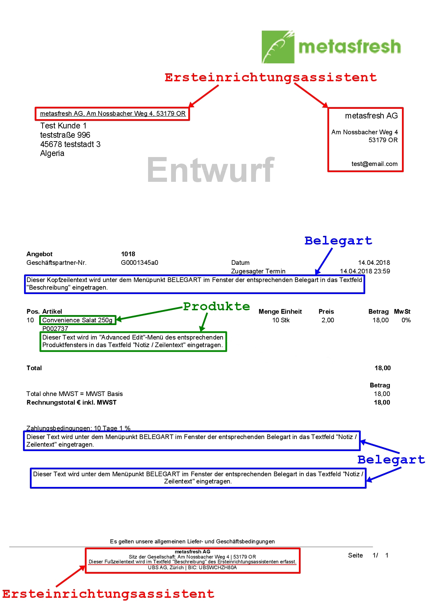

## Übersicht
In metasfresh kannst Du Deine Belege um eigenen Text erweitern und sie so Deinen geschäftlichen Bedürfnissen und Bedingungen entsprechend modifizieren.

Zum Beispiel kannst Du an den Anfang eines Angebotes eine Beschreibung desselben setzen und am Ende eine Notiz für den Kunden hinterlassen oder das bestellte Produkt näher beschreiben.

Diese Texte kannst Du auf verschiedene Art und Weise in metasfresh erfassen. Bei der Belegerstellung werden sie dann automatisch an den dafür vorgesehenen Stellen auf den Belegen eingefügt.

Auf der folgenden Abbildung eines Angebotes werden die modifizierbaren Textstellen hervorgehoben sowie die jeweiligen Menüpunkte aufgezeigt, wo sie in metasfresh bearbeitet werden können:

---

## Ersteinrichtungsassistent

#### Anschrift des Absenders und Belegfuß bearbeiten
Klicke [hier](Ersteinrichtung), wenn Du die Textstellen mithilfe des Ersteinrichtungsassistenten bearbeiten möchtest.

---

## Belegart

#### Text am Beleganfang und -ende hinzufügen
Klicke [hier](Text_auf_Belege_drucken-Belegart), wenn Du am Anfang und Ende des Belegs Texte einfügen möchtest.

---

## Produkte

#### Partnerspezifische Produkte verwalten
Klicke [hier](Partnerspezifische_Produkte), wenn Du partnerspezifische Produktnamen und -nummern erfassen möchtest, die anstelle Deiner intern verwendeten Namen und Nummern auf den Belegen der jeweiligen Geschäftspartner erscheinen.

#### Allgemeine Produktbeschreibung hinzufügen
Klicke [hier](Text_auf_Belege_drucken-Produkt), wenn Du einem Produkt eine allgemeine Beschreibung hinzufügen möchtest, die auf allen Belegen erscheint.

#### Auftragszeilenspezifische Produktbeschreibung hinzufügen
Klicke [hier](Auftragszeilenspezifische_Produktbeschreibung), wenn Du einem Produkt eine Beschreibung hinzufügen möchtest, die ausschließlich auf der jeweiligen Auftragsbestätigung erscheint.

---

## Rechnungen

#### Rechnungsspezifische Belegtexte
Klicke [hier](Rechnungsspezifische_Belegtexte), wenn Du rechnungsspezifische Belegtexte erfassen möchtest, die ausschließlich auf dem jeweiligen Rechnungsbeleg erscheinen.

---

## Einkaufsbestätigung

#### Abladeort ändern
Klicke [hier](Abladeort_aendern), wenn Du die Adresse des Abladeortes für Wareneingänge auf der Einkaufsbestätigung ändern möchtest.
