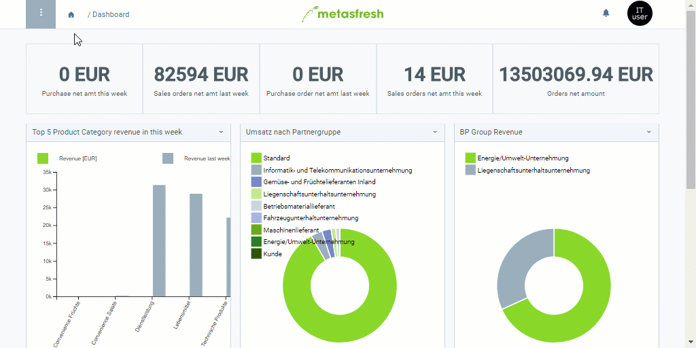

## Übersicht
Mithilfe von Textbausteinen kannst Du Textvorlagen für Briefe und E-Mails erstellen, welche Du u.a. auch in Marketingkampagnen einsetzen kannst, z.B. in [Serienbrief-Kampagnen](Serienbriefe_erstellen).

## Schritte
1. [Gehe ins Menü](Menu) und öffne das Fenster "Textbausteine".
1. [Lege einen neuen Textbaustein an](Neuer_Datensatz_Fenster_Webui).
1. Benenne den Textbaustein im Feld **Name**.
1. Gib einen **Betreff** an.
1. Gib in das Textfeld **TextSchnipsel** einen Text ein.
1. [metasfresh speichert automatisch](Speicheranzeige).

## Beispiel

