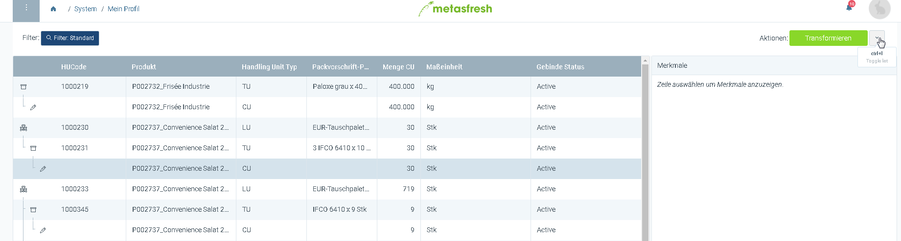
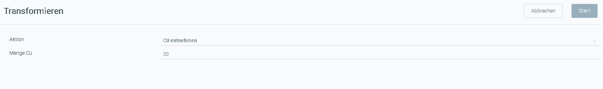

## Schritte

1. gehe ins Fenster Handling Unit
1. Wähle die CU-Ebene einer Handling Unit und starte die Quick-Action "transformieren"

1. Wähle Aktion "CU entnehmen"
1. Bestätige mit CU

## Erklärung

Nun wird die CU aus der Handling Unit genommen und die übriggebliebene LU und TU zerstört.
