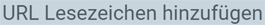

## Schritte

### URL als Anhang speichern
1. [Öffne](Menu) das Dokument, dem Du ein URL-Lesezeichen anhängen möchtest, z.B. einem "[Geschäftspartner](Neuer_Geschaeftspartner)".
1. Drücke `Alt` + `7` / `⌥ alt` + `7`, um zur Anhangliste  in der [Sidebar](SpringezuBelegen)  zu springen.
1. Klicke auf . Es öffnet sich ein kleines Overlay-Eingabefenster.
1. Kopiere die gewünschte URL (z.B. http://metasfresh.com/) und füge sie in das Feld **URL** ein.
1. Im Feld **Name** kannst Du das URL-Lesezeichen benennen, z.B. "metasfresh Homepage". Wenn Du keinen Namen vergibst, wird die URL übernommen.
1. Klicke auf "Create", um das Lesezeichen der Anhangliste hinzuzufügen und das Overlay-Fenster zu schließen.
 >**Hinweis:** Du kannst pro Dokument beliebig viele URLs anhängen.

### URL öffnen
Zum Öffnen, drücke `Alt` + `7` / `⌥ alt` + `7`, um zur Anhangliste zu [springen](SpringezuBelegen) und klicke einfach auf das URL-Lesezeichen (siehe Beispiel).

### URL löschen
Zum Löschen, drücke `Alt` + `7` / `⌥ alt` + `7`, um zur Anhangliste zu [springen](SpringezuBelegen) und klicke einfach auf das kleine Löschsymbol  neben dem URL-Lesezeichen, welches Du löschen möchtest (siehe Beispiel).
 >**Hinweis:** Sollte das Löschsymbol nicht erscheinen, verfügt Deine Benutzerrolle möglicherweise nicht über eine Löschberechtigung. [Folge dieser Anleitung](Dateihandling_Loeschberechtigung), um die Löschberechtigungen für Benutzerrollen einzustellen.

## Beispiel

