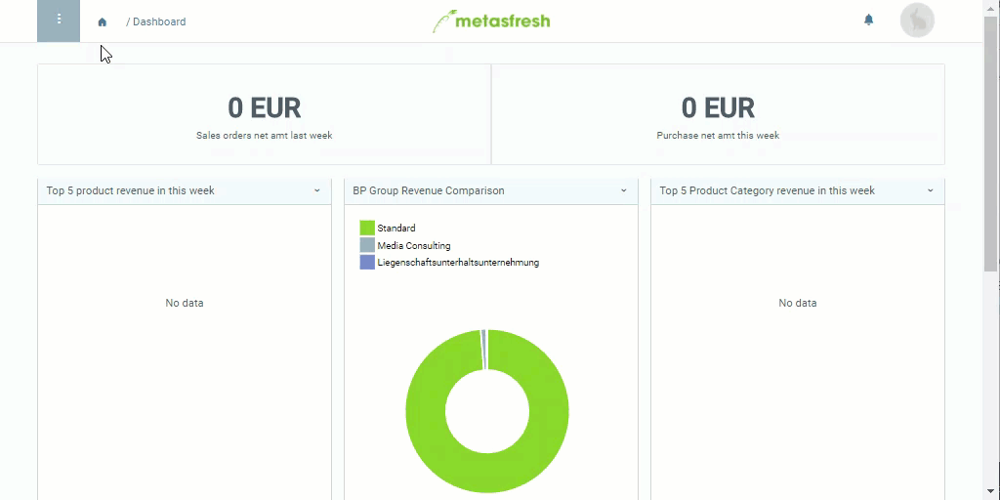

## Übersicht
Wenn Du eine Produktkategorie einer anderen unterordnest, welche mit einem [Kompensationsgruppenschema verknüpft](Kompensationsgruppenschema_Produktkategorie) ist, dann wird beim [Gruppenrabattierungsprozess](Automatische_Gruppenrabatte) das Schema der übergeordneten Kategorie auf die Kompensationsgruppierung angewendet. So lassen sich einzelne Produkte unterschiedlich voneinander kategorisieren und trotzdem als Gruppe rabattieren.

## Schritte
1. [Gehe ins Menü](Menu) und öffne das Fenster "Produkt Kategorie".
1. Öffne den Eintrag einer bestehenden Produktkategorie bzw. [lege eine neue an](NeueProduktkategorie).
1. Gehe zum Feld **Übergeordnete Kategorie** und wähle die gewünschte Produktkategorie aus.
1. [metasfresh speichert automatisch](Speicheranzeige).

## Beispiel

