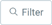
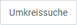

## Übersicht
In vielen Fenstern, in denen es Einträge gibt, die mit [Geschäftspartnern](Neuer_Geschaeftspartner) verknüpft sind (z.B. unter [Aufträge](Auftrag_erfassen), [Bestellungen](Bestellung_erfassen), [Geschäftspartner](Neuer_Geschaeftspartner), [Anrufliste](Anrufplanung_mittels_Anruflisten) usw.) kannst Du die Umkreissuche verwenden, um Dir nur die Einträge anzeigen zu lassen, die sich geografisch ähneln.

## Voraussetzungen
- [Lege einen Geschäftspartnereintrag samt Adresse an](Adresse_erfassen_Tab).

| Wichtig! |
| :--- |
| Damit die Umkreissuche einwandfrei funktioniert, muss die Adresse ***mindestens*** aus einer Postleitzahl (**PLZ**) und dem **Land** bestehen. |

## Schritte
1. Öffne ein Fenster Deiner Wahl, in dem die Umkreissuche als Filter zur Verfügung steht, in der [Listenansicht](Ansichten), z.B. "[Geschäftspartner](Menu)".
1. Klicke auf  oben links im Fenster und dann auf .
1. Trage je nach Bedarf **Straße und Nr.**, **PLZ**, **Ort** und/oder **Land** ein.
1. Gib eine **Entfernung** ein und klicke auf .
 >**Hinweis:** Drücke `Alt` + `↵ Enter` / `⌥ alt` + `↵ Enter`, um die Filterkriterien anzuwenden.
