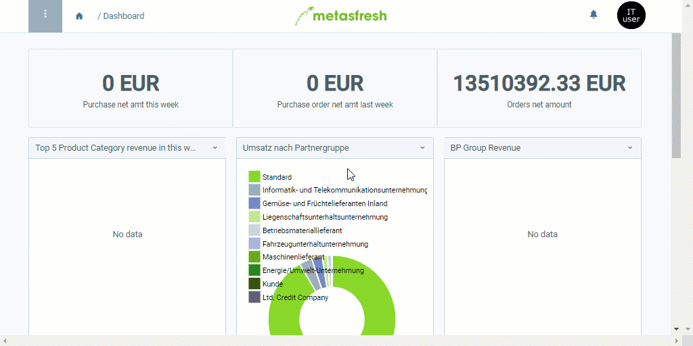

## Überblick
In vielen Fenstern, in denen es Einträge gibt, die mit [Geschäftspartnern](Neuer_Geschaeftspartner) verknüpft sind (z.B. unter [Aufträge](Auftrag_erfassen), [Bestellungen](Bestellung_erfassen), [Geschäftspartner](Neuer_Geschaeftspartner), [Anrufliste](Anrufplanung_mittels_Anruflisten) usw.) kannst Du die Umkreissuche verwenden, um die Suchergebnisse auf einen bestimmten geografischen Bereich einzuschränken.

Darüber hinaus kannst Du direkt aus dem Geschäftspartnereintrag standortspezifische Umkreissuchen starten, wobei die Ergebnisse anhand der von Dir ausgewählten Adresse vorgeschlagen werden.

## Voraussetzungen
- [Lege einen Geschäftspartnereintrag samt Adresse an](Adresse_erfassen_Tab).

| **Wichtig!** |
| :--- |
| Damit die Umkreissuche einwandfrei funktioniert, muss die Adresse ***mindestens*** aus einer Postleitzahl (**PLZ**), dem **Ort** und dem **Land** bestehen. |

## Schritte

### a) Filter zur Umkreissuche verwenden
1. [Öffne ein Fenster](Menu) Deiner Wahl, in dem die Umkreissuche als Filter zur Verfügung steht, in der [Listenansicht](Ansichten), z.B. "[Geschäftspartner](Menu)".
1. Klicke auf  oben links im Fenster und dann auf .
1. Trage je nach Bedarf **Straße und Nr.**, **PLZ**, **Ort** und/oder **Land** ein.
1. Gib eine **Entfernung** ein und klicke auf .
 >**Hinweis:** Drücke `Alt` + `↵ Enter` / `⌥ alt` + `↵ Enter`, um die Filterkriterien anzuwenden.

### b) Standortspezifische Umkreissuche
1. Öffne den Eintrag eines bestehenden [Geschäftspartners](Menu) in der [Einzelansicht](Ansichten) bzw. [lege einen neuen an](Neuer_Geschaeftspartner).
1. Gehe zur Registerkarte "Adresse" unten auf der Seite.
1. Selektiere einen [Adresseintrag](Adresse_erfassen_Tab) Deiner Wahl, der als Ausgangspunkt für  die Umkreissuche verwendet werden soll.
1. [Starte die Aktion](AktionStarten) "Umkreissuche". Es öffnet sich ein Overlay-Fenster.
1. Gib eine **Entfernung** ein.
1. Klicke auf "Start", um das Overlay-Fenster zu schließen und die Umkreissuche zu beginnen.
1. Es öffnet sich ein neuer Browser-Tab mit den [herausgefilterten](Filterfunktion) Ergebnissen der Umkreissuche.

## Beispiel

