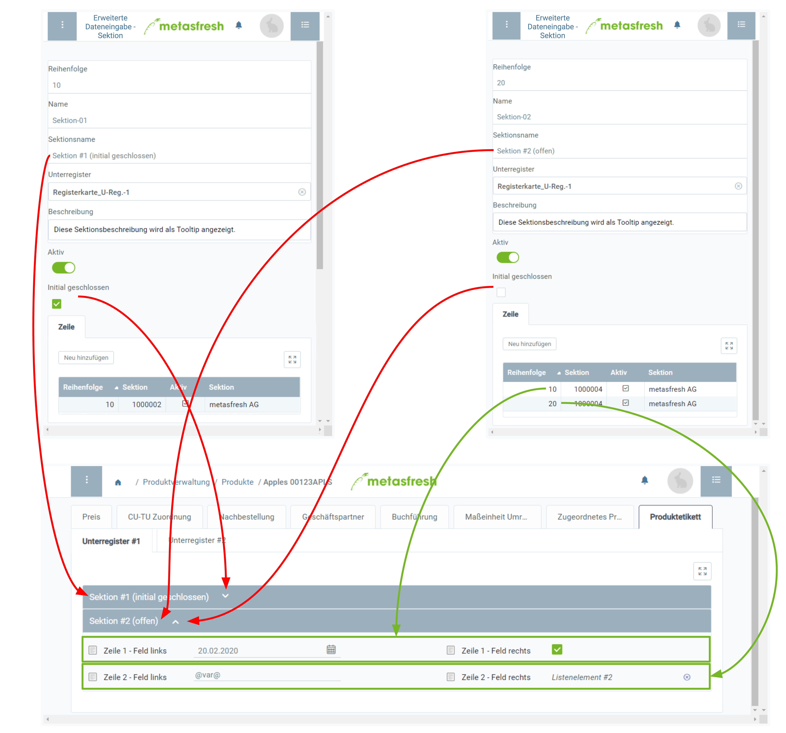

## Voraussetzungen
- [Lege eine benutzerdefinierte Registerkarte mit Unterregistern an](Benutzerdefinierte_Registerkarte_anlegen).

## Schritte

### Sektion hinzufügen
1. [Gehe ins Menü](Menu) und öffne das Fenster "Erweiterte Dateneingabe - Sektion".
1. [Erstelle einen neuen Eintrag](Neuer_Datensatz_Fenster_Webui).
1. Gib in das Feld **Name** einen systeminternen Sektionsnamen ein.
 >**Hinweis:** Dieser Name dient nur der systeminternen Referenz und wird nicht als Sektionsname angezeigt.

1. Benenne die Sektion im Feld **Sektionsname**.
 >**Hinweis:** Dieser Name wird an entsprechender Stelle in dem Unterregister zu lesen sein.

1. Gib in das Feld **Unterregister** einen Teil des (systeminternen) Namens des [Unterregisters](Benutzerdefinierte_Registerkarte_anlegen) ein, in dem die Sektion erscheinen soll, und klicke auf den passenden Treffer in der <a href="Keyboard_Shortcuts_Liste#dropdown" title="Dynamisches Suchfeld (Autocomplete)">Dropdown-Liste</a>.
 >**Hinweis:** Bei mehreren Sektionen für dasselbe Unterregister kannst Du deren **Reihenfolge** bestimmen.

1. ***Optional:*** Erfasse eine **Beschreibung** in dem dafür vorgesehenen Textfeld.
1. ***Optional:*** Setze ein Häkchen bei **Initial geschlossen**, wenn die Sektion beim öffnen des Unterregisters geschlossen sein soll.

### Zeilen hinzufügen
1. Gehe zur Registerkarte "Zeile" unten auf der Seite und klicke auf . Es öffnet sich ein Overlay-Fenster.
1. Klicke auf "Bestätigen", um das Overlay-Fenster zu schließen und die Zeile zur Liste hinzuzufügen.
 >**Hinweis 1:** Wiederhole die Schritte 1 bis 2, um weitere Zeilen hinzuzufügen.  
 >**Hinweis 2:** Bei mehreren Zeilen für dieselbe Sektion kannst Du deren **Reihenfolge** bestimmen.

 

| **Wichtiger Hinweis:** |
| :--- |
| Die benutzerdefinierte Registerkarte samt den Sektionen und Zeilen wird erst in dem jeweiligen Eingabefenster angezeigt, wenn die Sektionszeilen auch Felder beinhalten. |

## Nächste Schritte
- [Füge den Sektionszeilen Felder hinzu](Sektionszeilen_Felder_hinzufuegen).

## Beispiel

