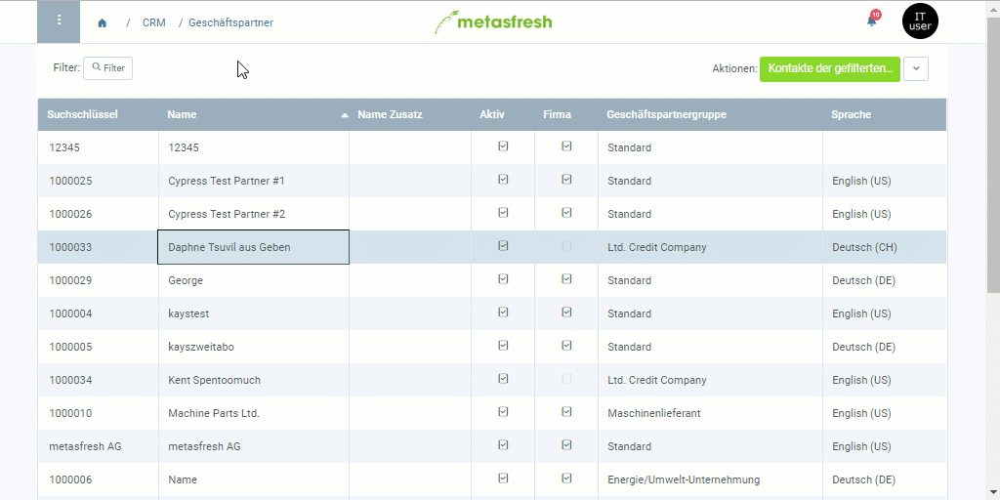
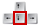
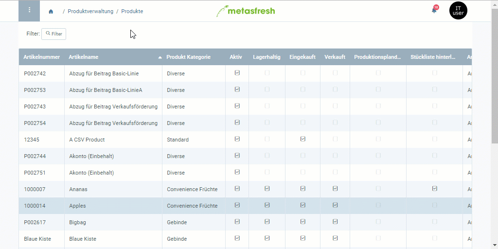

## Übersicht
In metasfresh kannst Du alle Produkte, die auf einer Preisliste stehen, an alle Geschäftspartner verkaufen bzw. bei allen Partnern einkaufen, die mit derselben Preisliste verknüpft sind. Doch was ist, wenn Du einzelnen Partnern nur eine bestimmte Auswahl an Produkten zur Verfügung stellen willst, ohne für jeden einzelnen eine neue Preisliste zu erstellen, die bis auf die ausgenommenen Produkte identisch mit der ursprünglichen wäre und ansonsten nur zu duplizierten Daten und zusätzlichem Organisationsaufwand führen würde?

Für diesen Fall kannst Du ganz einfach partnerbezogene Ausschlusslisten mit denjenigen Produkten erstellen, die für den Verkauf bzw. Einkauf gesperrt werden sollen und somit in Aufträgen oder Bestellungen nicht mehr hinzugefügt werden können. Diese Listen kannst Du sowohl im Produkteintrag als auch im Geschäftspartnereintrag erstellen. Gehe hierzu wie folgt vor:

## Via Geschäftspartner

### Schritte
1. Öffne den Eintrag eines bestehenden [Geschäftspartners](Menu) bzw. [lege einen neuen an](Neuer_Geschaeftspartner).
1. Gehe zur Registerkarte "Produkt" unten auf der Seite und klicke auf . Es öffnet sich ein neues Fenster.
1. Trage das **Produkt** ein, das Du für den Verkauf/Einkauf sperren möchtest.
1. Trage im Textfeld **Produkt Sperre Grund** einen Grund ein, weshalb das Produkt für den Geschäftspartner gesperrt ist.
 >**Hinweis:** Dieser Grund erscheint dann in einer Fehlermeldung an den Nutzer, wenn dieser das gesperrte Produkt in einem Auftrag oder einer Bestellung hinzufügen möchte.

1. Setze ein Häkchen bei **Produkt Sperre Verkauf**.
 > **Hinweis:** Diese Einstellung betrifft ***Aufträge und Bestellungen gleichermaßen***, je nachdem ob es sich bei dem Geschäftspartner um einen [Kunden](Neuer_Geschaeftspartner_Kunde) oder einen [Lieferanten](Neuer_Geschaeftspartner_Lieferant) handelt.

1. Klicke auf "Bestätigen", um das Fenster zu schließen und das gesperrte Produkt zur Liste hinzuzufügen.
 >**Hinweis:** Wiederhole die Schritte 2 bis 6, um weitere Verkaufs-/Einkaufssperren für weitere Produkte zur Liste hinzuzufügen.

### Beispiel

---

## Via Produkte

### Schritte
1. Öffne den Eintrag eines bestehenden [Produktes](Menu) bzw. [lege ein neues an](NeuesProdukt).
1. Gehe zur Registerkarte "Geschäftspartner" unten auf der Seite und klicke auf . Es öffnet sich ein neues Fenster.
1. Trage den Namen des **Geschäftspartners** ein, für den das Produkt gesperrt werden soll.
 >**Hinweis 1:** Geschäftspartner können Kunden und Lieferanten sein.  
 >**Hinweis 2:** Drücke die `LEERTASTE`, um alle Geschäftspartner zu sehen.  
 >**Hinweis 3:** Auswahl des Treffers mit Maus oder .

1. Scrolle runter bis zum Feld **Exclusion from sales documents** und setze hier ein Häkchen. Es erscheint ein neues Textfeld **Exclusion From Sale Reason**.
 > **Hinweis:** Diese Einstellung betrifft ***Aufträge und Bestellungen gleichermaßen***, je nachdem ob es sich bei dem Geschäftspartner um einen [Kunden](Neuer_Geschaeftspartner_Kunde) oder einen [Lieferanten](Neuer_Geschaeftspartner_Lieferant) handelt.

1. Trage im Textfeld **Exclusion From Sale Reason** einen Grund ein, weshalb das Produkt für den Geschäftspartner gesperrt ist.
 >**Hinweis:** Dieser Grund erscheint dann in einer Fehlermeldung an den Nutzer, wenn dieser das gesperrte Produkt in einem Auftrag oder einer Bestellung hinzufügen möchte.

1. Klicke auf "Bestätigen", um das Fenster zu schließen und die Verkaufs-/Einkaufssperre zur Liste hinzuzufügen.
 >**Hinweis:** Wiederhole die Schritte 2 bis 6, um weitere Verkaufs-/Einkaufssperren für weitere Geschäftspartner zur Liste hinzuzufügen.

### Beispiel

