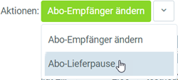

## Schritte
1. Öffne den Eintrag eines [laufenden Vertrags](Abonnementvertrag_erfassen).
1. [Starte die Aktion](AktionStarten#aktionsmenue) "Abo-Lieferpause". Es öffnet sich ein Overlay-Fenster.
 >**Hinweis:** Hast Du den Vertrag in der [Listenansicht](Ansichten#listenansicht) [selektiert](AuswahlBelege), kannst Du ebenfalls über den [Quick-Actions](AktionStarten#quick-actions)-Button oben rechts die Aktion "Abo-Lieferpause" starten. 
 

1. Wähle im Feld **Datum** den Zeitraum aus, wie lange der Vertrag pausiert werden soll.
1. Klicke auf "Start", um die Änderungen zu übernehmen und das Overlay-Fenster zu schließen.
  

| **Hinweis:** |
| :--- |
| Den **Vertrags-Status** kannst Du unter der Registerkarte "Abo Verlauf" unten auf der Seite des jeweiligen Vertrages einsehen. |

## Beispiel

