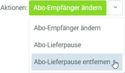

## Schritte
1. Öffne einen [pausierten Vertrag](Vertrag_Lieferpause_einstellen).
1. [Starte die Aktion](AktionStarten) "Abo-Lieferpause entfernen".
 >**Hinweis:** Hast Du den Vertrag in der [Listenansicht](Ansichten) selektiert, kannst Du ebenfalls über den [Quick-Actions](AktionStarten)-Button oben rechts die Aktion "Abo-Lieferpause entfernen" starten. 
 

 

| **Hinweis:** |
| :- |
| Den **Vertrags-Status** der einzelnen Lieferung kannst Du in der Registerkarte "Abo Verlauf" bzw. "Abo Prognose" unten auf der Seite des jeweiligen Vertrags einsehen. |

## Beispiel

