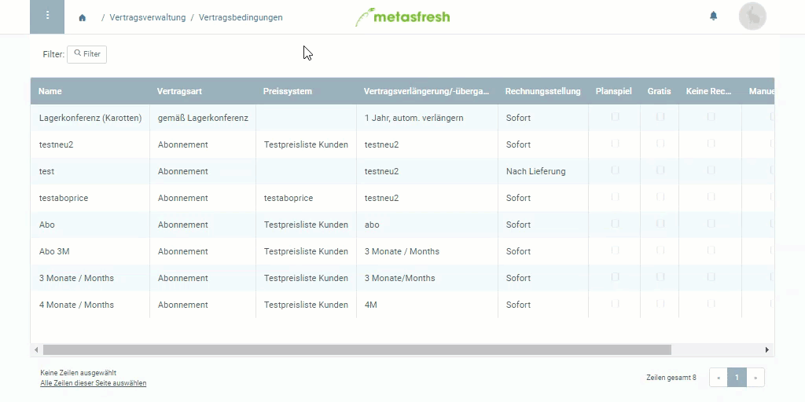

## Schritte
1. [Gehe ins Menü](Menu) und öffne das Fenster "Vertragsbedingungen".
1. [Erstelle einen neuen Eintrag](Neuer_Datensatz_Fenster_Webui).
1. Benenne die Vertragsbedingungen im Feld **Name**.
1. Wähle eine **Vertragsart** aus, z.B. *Abonnement*.
1. Wähle ein **Preissystem** aus.
1. Im Feld [**Vertragsverlängerung/-übergang**](Vertragslaufzeit_definieren) kannst Du die Vertragslaufzeit einstellen.
1. [Stelle das Dokument fertig](BelegverarbeitungFertigstellen).

## Beispiel

