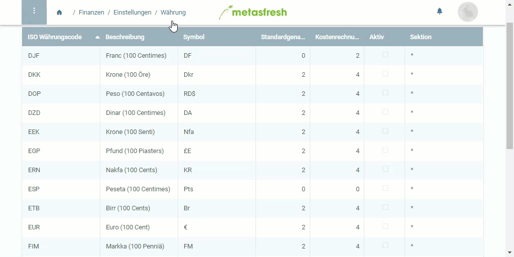

## Schritte

1. [Gehe ins Menü](Menu) und öffne den Link "Währung".
1. Wähle die Währung, welche Du aktivieren möchtest, in der [Listenansicht](Ansichten) aus.
1. [Aktiviere](Datensatz_aktivieren) die Währung.

## Beispiel

