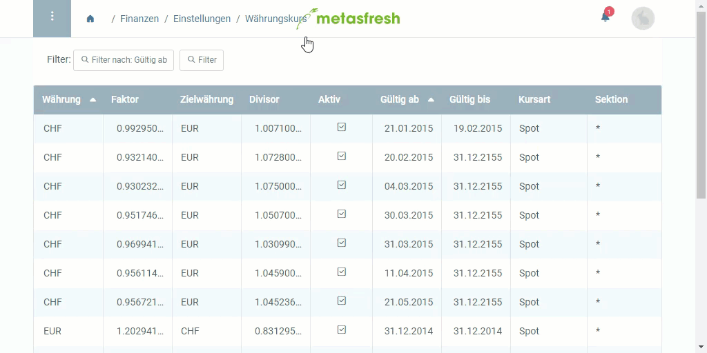

## Überblick
Wenn Du mit einer anderen Währung als Deiner Stammwährung arbeiten möchtest, musst Du einen Währungskurs für die Umrechnung einstellen.

**Beispiel:** 
Du hast Dein metasfresh System mit dem [Einrichtungsassistenten](Ersteinrichtungsassistent) auf EUR eingestellt, möchtest aber auch mit USD arbeiten.

## Schritte
1. [Gehe ins Menü](Menu) und öffne das Fenster "Währungskurs".
1. [Lege einen neuen Währungskurs an](Neuer_Datensatz_Fenster_Webui).
1. Wähle eine Ausgangswährung (**Währung**) und eine **Zielwährung**, z.B. EUR nach USD.
 >**Hinweis:** Jeder Währungskurs muss einzeln festgelegt werden, z.B. EUR nach USD, USD nach EUR usw.

1. Gib *entweder* den **Faktor** *oder* den **Divisor** ein, der für die Kursumrechnung verwendet werden soll.
 >**Hinweis:** Der jeweils andere Operand wird automatisch berechnet.

1. Wähle die **Kursart** *Spot* aus.
1. Stelle ein **Gültig ab** Datum ein.
 >**Hinweis:** Liegt das Datum in der *Vergangenheit*, ist der Währungskurs *ab sofort* gültig. Liegt es in der *Zukunft*, gilt er *erst ab diesem Datum*.

1. [metasfresh speichert automatisch](Speicheranzeige).
 >**Hinweis:** Wiederhole die Schritte 2 bis 6, um weitere Kursumrechnungen anzulegen, z.B. USD nach EUR.

## Fehlermeldung
Wenn die Umrechnung nicht korrekt eingestellt ist, gibt es bei der Erstellung eines Wareneingangs oder einer Abrechnung eine Fehlermeldung dieser Art:

`... Unable to convert from currency $ ... to currency € ...`

## Beispiel

