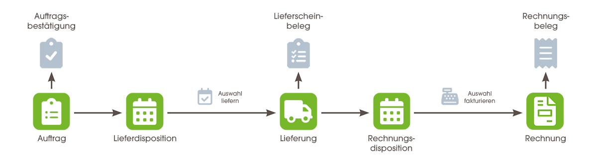

<kbd></kbd>

## Schritte
1. [Melde Dich bei metasfresh an](Anmeldung).
1. [Erfasse einen neuen Auftrag](Auftrag_erfassen).
1. [Erstelle einen Lieferschein](Zu_Auftrag_Lieferschein_erstellen) zu dem Auftrag.
1. [Erstelle eine Rechnung](Zu_Auftrag_Rechnung_erstellen) zu dem Auftrag.
