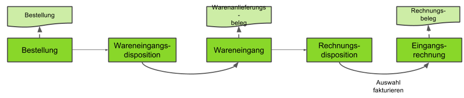

## Schritte
1. [Melde Dich an](Anmeldung).
1. [Erfasse eine neue Bestellung](Bestellung_erfassen).
1. [Erstelle einen Wareneingang](Zu_Bestellung_Wareneingang_erstellen) zu der Bestellung.
1. [Erstelle eine Rechnung](Zu_Bestellung_Eingangsrechnung_erstellen) zu der Bestellung.
