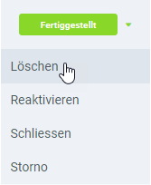
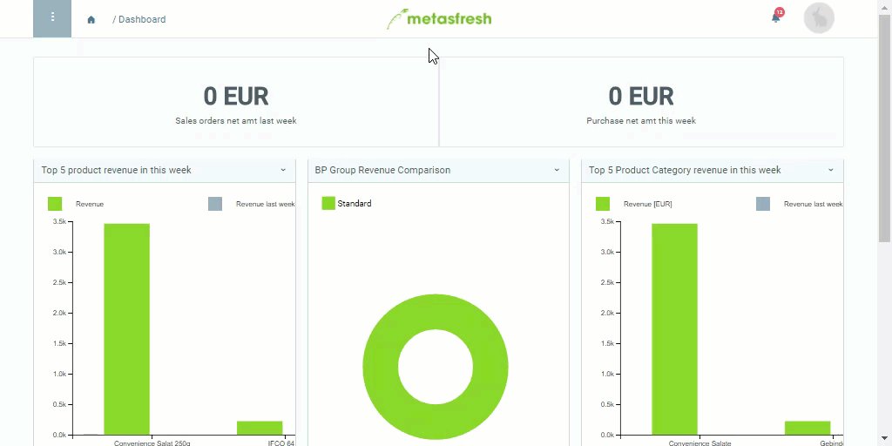

## Überblick
In metasfresh kannst Du falsch verbuchte Zahlungseingänge schnell wieder stornieren und gleichzeitig den *Bezahlt*-Status der zugeordneten Rechnungen rückgängig machen. Gehe hierzu wie folgt vor:

## Schritte
1. [Gehe ins Menü](Menu) und öffne das Fenster "Zahlungen".
1. Öffne den Eintrag einer [verbuchten Zahlung](Einzelner_Zahlungseingang).
1. Öffne das [Belegverarbeitungsmenü](AktionStarten) (`Alt` + `I` / `⌥ alt` + `I`) und klicke auf *Löschen*. 

1. Die Zahlung wurde nun rückgängig gemacht.
1. [metasfresh speichert automatisch](Speicheranzeige).

## Beispiel

