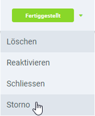

## Schritte
1. [Gehe ins Menü](Menu) und öffne den Link "Zahlungen".
1. Öffne eine [fertiggestellte Zahlung](Einzelner_Zahlungseingang).
1. Öffne das [Belegverarbeitungsmenü](AktionStarten) (`Alt + I`) und klicke auf *Storno*. 
 

1. [metasfresh speichert automatisch](Speicheranzeige).

## Beispiel

