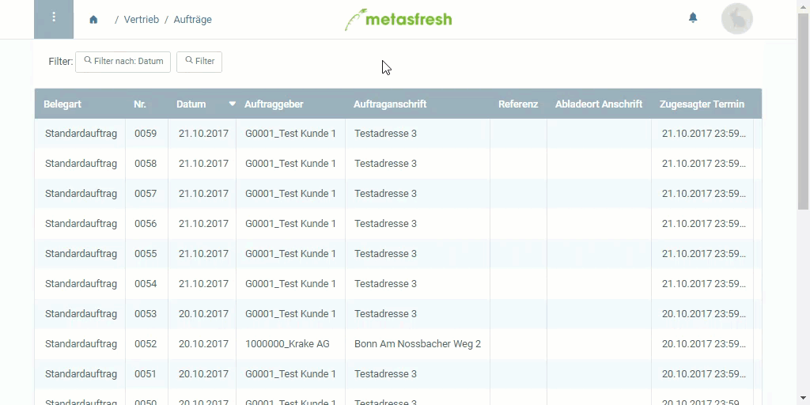

## Übersicht
In metasfresh kann man den Inhalt vieler Tabellenfelder auch über die Zoom-Funktion erreichen. Damit kannst Du Dir oftmals den Weg über das Navigationsmenü ersparen und schnell zwischen den Fenstern hin- und herspringen.

## Schritte
1. Gehe mit dem Mauszeiger über das Tabellenfeld, zu dessen Inhalt Du springen möchtest, und öffne mit einem Rechtsklick das Kontextmenü.
1. Klicke auf .
1. Es öffnet sich eine neue Registerkarte mit den Detaildaten des Feldes.

**Wichtig:** Dieses Feature funktioniert nur bei deaktiviertem Pop-Up-Blocker!

## Beispiel

