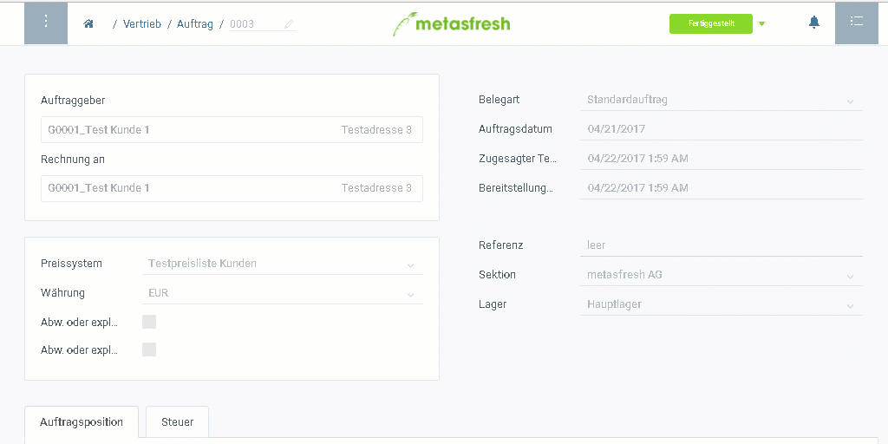

## Schritte

1. [Starte von einem fertigen Auftrag](Auftrag_erfassen)
1. [Springe zur Lieferdisposition](SpringezuBelegen)
1. Wähle die Auftragszeilen aus, die Du liefern möchtest
1. Starte die Aktion "Auswahl liefern"
1. Bestätige mit OK
1. Folge dem Link in der Notifikation, die Du erhälst sobald die Lieferung erstellt ist, um den Lieferschein zu öffnen

